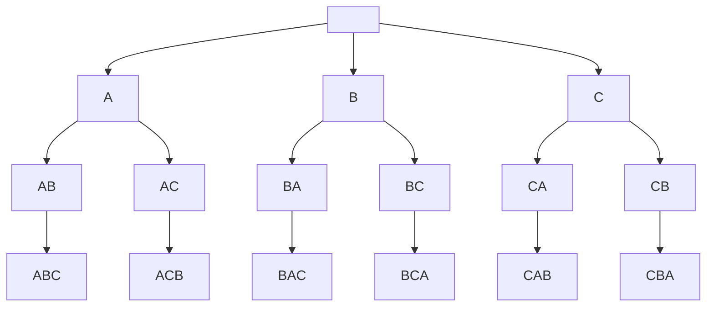
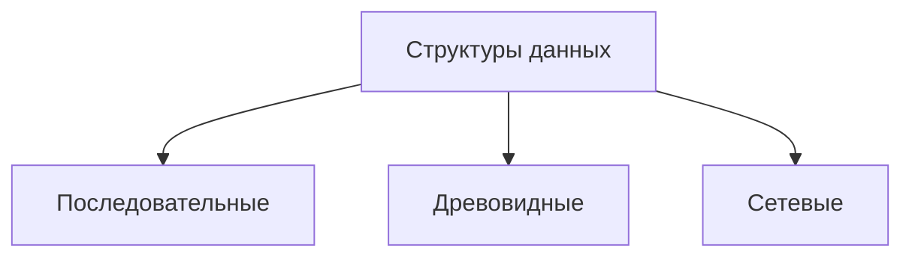
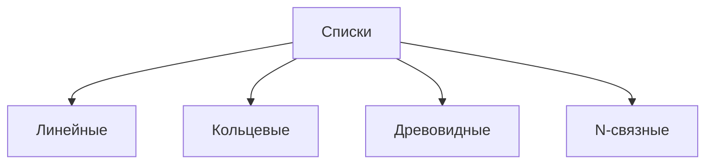
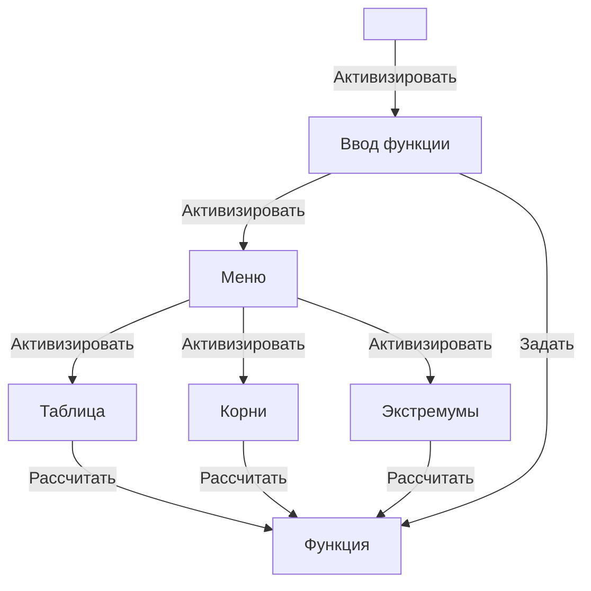

# Основы программирования. Теория

**Язык**: *Delphi Pascal*.

## Синтаксис и семантика языков программирования. Алфавит языка Delphi Pascal. Описание синтаксиса языка: синтаксические диаграммы

**Синтаксис** - совокупность правил, определяющих допустимые конструкции (слова, предложения) языка, его форму.

**Семантика**  -- правила, определяющие смысл синтаксически корректных предложений.

Ясная или «интуитивно-понятная» *семантика* -- семантика, позволяющая без большого труда определять смысл программы или «читать» ее.

Алфавит языка программирования *Delphi Pascal* включает:
1. латинские буквы **без различия** строчных и прописных + символ `_` (считается как буква);
2. арабские цифры: `0`, `1`, `2`, `3`, `4`, `5`, `6`, `7`, `8`, `9`;
3. шестнадцатеричные цифры: `0..9`, `а..f` или `A..F`;
4. специальные символы: `+` `-` `*` `/` `=` `:=` `;` и т.  д.;
5. служебные слова: `do`, `while`, `begin`, `end` и т.  д.

**Синтаксис** -- правила, определяющие допустимые конструкции языка, построенные из символов его алфавита.

**Синтаксическая диаграмма** — это направленный граф с одним входным ребром и одним выходным ребром и помеченными вершинами. Синтаксическая диаграмма задаёт язык. Цепочка пометок при вершинах на любом пути от входного ребра к выходному — это цепочка языка, задаваемого синтаксической диаграммой.


## Представление данных в Delphi Pascal: константы и переменные

### Представление данных

* Данные.
  1. Константы.
      1. Литералы.
      2. Поименованные константы.
  2. Переменные.

В языке *Delphi Pascal*  все данные подразделяются на *константы* и *переменные*:

**Константы** -- данные, не изменяемые в процессе выполнения программы.

Константы, в свою очередь, подразделяются на *литералы* и *поименованные константы*.

**Литералы** -- константы, указанные непосредственно в тексте программы.

Примеры  литералов:
1. `-25`, `2.5`, `0.1e6` -- числовые литералы;
2. `$2a` -- шестнадцатеричное число;
3. `true`, `false` -- логические константы;
4. `'d'`, `#65 = 'A'` -- символьные константы;
5. `'abcd'`  -- строковая константа;
6. `nil`  -- адресная константа.

**Поименованные константы** -- константы, обращение к которым выполняется по имени. Объявляются в разделе описаний: `const <имя>[: <тип>] = <значение>;`.

```pascal
const
    min: byte = 0;
    max = 100;
    center = (max - min) div 2;
```

-----

**Переменные** -- поименованные данные, которые могут изменяться в процессе выполнения программы. Объявляются также в разделе описаний: `var <имя>[, <имя>]: <тип>;`
```pascal
var
    a, b:integer;
    c:real;
```

---

При установленной опции  `Extended syntax`  `{$X+}` (*расширенный синтаксис*) переменным при объявлении можно задавать начальные значения:
```pascal
var
    a: integer = 56;
    b: real = 85.25;
```

-----
Для **наложения** или же создания **абсолютной переменной** (которая находится по заданному или абсолютному адресу в памяти) используется служебное слово **`absolute`**:

`var <имя>: <тип> absoulute <адрес>:<смещение>;` или

`var <имя>: <тип> absoulute <переменная>;`.

```pascal
//Наложение по абсолютному адресу:
var
    a: Word absolute $0000:$00FF;  // адрес_сегмента:смещение
    c: Byte;
    b: Real absolute c;  // наложение на ранее определенную переменную;
       // обычно используется, когда тип переменной, которая тут `c`, может быть разным.
       // (см. нетипизированные параметры)
```

-----

**Тип** -- описатель данных, который определяет:
1. диапазон изменения значения переменной, задавая размер ее внутреннего представления;
2. множество операций, которые могут выполняться над этой переменной.

Для объявления новых типов данных используется конструкция: `type <имя> = <тип>;`:
```pascal
type
    int = longint;
    date = 1..31;  // объявление нового типа данных

var
    d1: date;  // объявление переменной этого типа
```

## Классификация  скалярных типов данных, операции над ними

### Классификация типов данных языка
1. Тип
    1. Простой
        1. Порядковые
            1. Целые;
            2. Логические;
            3. Символ;
            4. Перечисление;
            5. Отрезок (Интервал);
        3. Вещественный
            1. Вещественные;
            2. Большое целое;
    2. Структурный
        1. Массив;
        2. Строка;
        3. Запись;
        4. Множество;
        5. Файл;
        6. Указатель; <!--- Разве указатель это не просто целое беззнаковое число? -->

* **Целочисленные знаковые типы**
  |Идентификатор|Длина, байт|Диапазон значений|
  |--|--|--|
  |`ShortInt`, `Int8`|`1`|$-128..127$|
  |`SmallInt`, `Int16`|`2`|$-32768..32767$|
  |*`Integer`*\*|`2-4`|Зависит от платформы|
  |`LongInt`, `Int32`|`4`|$-2147483648..2147483647$|
  |`NativeInt`|`4-8`|Зависит от типа процессора|
  |`Int64`|`8`|$-9223372036854775808..9223372036854775807$|

* **Целочисленные беззнаковые типы**
  |Идентификатор|Длина, байт|Диапазон значений|
  |--|--|--|
  |`Byte`, `UInt8`|`1`|$0..255$|
  |`Word`, `UInt16`|`2`|$0..65535$|
  |`LongWord`, `Cardinal`, `UInt32`, ~~`DWord`~~\*\*|`4`|$0..4294967295$|
  |*`NativeUInt`*|`4-8`|Зависит от типа процессора|
  |~~`QWord`~~\*\*, `UInt64`|`8`|$0..18446744073709551615$|

* **Вещественные типы**
  |Идентификатор|Длина, байт|Количество значащих цифр|Диапазон значений|
  |--|--|--|--|
  |`Single`|`4`|`7-8`|$-1.5 * 10^{-45} .. 3.4 * 10^{38}$|
  |`Real48`|`6`|`11-12` <!---Точно не знаю, взято среднее между 4 и 8 байтными типами--> |$2.9 * 10^{-39} .. 1.7 * 10^{38}$|
  |*`Real`*\*|`6-8`|???|Зависит от платформы|
  |`Double`|`8`|`15-16`|$-2.2 * 10^{-308} .. 1.8 * 10^{308}$|
  |`Currency`|`8`|(4 знака после запятой)|$-922337203685477.5808 .. 922337203685477.5807$|
  |`Comp`|`8`|`19-20`|$-9223372036854775807..9223372036854775807$|
  |*`Extended`*\*|`8`|`15-16`|$-2.2 * 10^{-308} .. 1.8 * 10^{308}$|
  |*`Extended`*\*|`10`|`19-20`|$-3.4 * 10^{-4932} .. 1.1 * 10^{4932}$|

* **Символьные типы**
  |Идентификатор|Длина, байт|Диапазон значений|
  |--|--|--|
  |`AnsiChar`|`1`|`#0..#255`|
  |*`Char`*\*|`1-2`|Зависит от платформы|
  |`WideChar`, ~~`UnicodeChar`~~\*\*|`2`|`#0..#65535`|

* **Логические типы**
  |Идентификатор|Длина, байт|Диапазон значений|
  |--|--|--|
  |`Boolean`|`1`|`False..True`|
  |`ByteBool`|`1`|`False..True`|
  |`WordBool`|`2`|`False..True`|
  |`LongBool`|`4`|`False..True`|

* **Перечисления** -- значения переменных этого типа описываются явно (перечисляются).
  ```pascal
  type
      DayOfWeek = (Mon, Tue, Wed, Thu, Fri, Sat, Sun);
  var
      d: DayOfWeek;
  {...}
  d := Fri;
  ```
* **Отрезок** -- значения переменных этого типа входят в определенный диапазон значений стандартного типа.
  ```pascal
  type
      Day = 1..31;  // значения - числа от 1 до 31
  var
      d: Day;
  {...}
  d := 5;
  ```
**\*** Зависит от платформы. В *Delphi Pascal*:
```pascal
type
	Integer = LongInt;  // FreePscal: SmallInt
	Real = Double;      // FreePascal: 6-byte
	// Extended (10 bytes)
	Char = WideChar;    // since Delphi 2009, FreePascal: ANSIChar
```
**\*\*** Идентификаторы отсутствуют в *Delphi Pascal*.

###### Источники: [wiki.freepascal.org 1](https://wiki.freepascal.org/Data_type), [wiki.freepascal.org 2](https://wiki.freepascal.org/Variables_and_Data_Types), [delphibasics.ru](http://delphibasics.ru/1Types.php).

### Процедуры и функции порядковых типов данных

1. Функция `ord(x: ordinal): int` -- возвращает номер значения по порядку (не применима к 64-битным аргументам)
   ```Pascal
   ord('A')  // 65
   ```
2. Функция `pred(x: ordinal): int` -- возвращает предыдущее значение.
   Процедура `dec(var x: int)` -- уменьшает значение переменной на `1`.
   ```Pascal
   x := 5;
   pred(x); // 4
   dec(x);  // 4
   ```
3. Функция `succ(x: ordinal): int` -- возвращает следующее значение.
   Процедура `inc(var x: int)` -- увеличивает значение переменной на `1`.
   ```Pascal
   x := 5;
   succ(x); // 6
   inc(x);  // 6
   ```
4. Функция `high(x)` -- возвращает самое большое значение типа переменной `x` или максимальный размер типа строки или массива переменной `x`.
   Функция `low(x)` -- возвращает самое малое значение типа переменной `x` или минимальный размер типа строки или массива переменной `x`.
   ```pascal
   var
	   x: ShortInt;
	   s: String[42];
	   m: array [5..35] of ShortInt;
   {...}
   writeLn(low(x), ', ', high(x));  // -128, 127
   writeLn(low(s), ', ', high(s));  // 0, 42
   writeLn(low(m), ', ', high(m));  // 5, 35
   ```

-----

### Операции над скалярными типами данных.

1. **Арифметические  операции** -- применяют к вещественным и целым константам и переменным:
   ```pascal
   + - *
   /  {вещественное деление}
   div, mod  {целочисленное деление и остаток от целочисленного}
   ```
2. **Операции отношения** -- применяют к числам, символам, строкам для сравнения. Результат -- логическое значение:
   |не равно|равно|
   |--|--|
   |<>|=|
   |**нестрогие**|**строгие**|
   |<|<=|
   |>|>=|
3. **Логические операции** -- применяют к логическим значениям. Результат логическое значение:
   ```pascal
   var
       a, b: Boolean;
   {...}
   a := true;
   b := false;
   a and b {false};  not a {false};  a xor b {true}
   a or b {true};    not b {true};   a xor a {false}
   ```
4. **Побитовые (поразрядные) операции** -- выполняются поразрядно, применяют к целым. Результат целое число.
   `not`, `and`, `or`, `xor`, `shr` (сдвиг вправо), `shl` (сдвиг влево).
   ```pascal
   var
       a: Byte;
   {...}
   a := 5;
   not a   {побитовая инверсия (НЕ)   : 00000101 -> 11111010};
   a shl 2 {побитовый сдвиг влево на 2: 00000101 -> 00010100};
   ```

-----

### Математические функции

(`int` -- абстрактный целочисленный тип, `float` -- абстрактный вещественный тип)

|Имя функции|Тип принимаемого значения|Тип возвращаемого значения|Описание|
|--|--|--|--|
|`abs(x)`|`int` или `float`|так же, как аргумент|Модуль числа (абсолютное значение числа)|
|`sqr(x)`|`int` или `float`|так же, как аргумент|Квадрат числа ($x^2$)|
|`sqrt(x)`|`int` или `float`|`float`|Квадратный корень числа ($\sqrt{x}$)|
|`exp(x)`|`int` или `float`|`float`|Экспонента числа ($e^x$)|
|`ln(x)`|`int` или `float`|`float`|Натуральный логарифм числа|
|`sin(x)`|`int` или `float`|`float`|Синус числа|
|`cos(x)`|`int` или `float`|`float`|Косинус числа|
|`arctan(x)`|`int` или `float`|`float`|Арктангенс числа|

### Работа с вещественными числами и генератором псевдослучайных чисел
|Функция|Описание|
|--|--|
|`int(x: float): int`|Целая часть числа `x`|
|`frac(x: float): int`|Дробная часть числа `x`|
|`randomize`|Инициализация генератора псевдослучайных чисел|
|`random: float`|Случайное число `r` в диапазоне: $0 \le r \lt 1$|
|`random(x: int): int`|Случайное целое число `r` в диапазоне: $0 \le r \lt x$|

## Совместимость типов данных и операции преобразования типов

### Правила вычисления выражений -- приоритеты
1. Порядок выполнения операций определяется **приоритетами и скобками**:
   ||Операции|Приоритет (порядок выполнения)|
   |--|--|--|
   |Унарные|`+`, `-`, `not`, `@`, `^`|1|
   ||`*`, `/`, `div`, `mod`, `and`, `shr`, `shl`|2|
   ||`+`, `-`, `or`, `xor`|3|
   |Логические|`=`, `<>`, `<`, `>`, `<=`, `>=`|4|

   Примеры:
   1. $\dfrac{x(x+2)}{y(y-1)} \Rightarrow x*(x+2) / y\textcolor{red}{/} (y-1) = x*(x+2) / \textcolor{red}{(}y*(y - 1)\textcolor{red}{)}$
   2. $\textcolor{red}{(}a < b\textcolor{red}{)} \space and \space \textcolor{red}{(}b >= 1\textcolor{red}{)}$

2. При выполнении арифметических операций над числами различных типов автоматически осуществляется **неявное преобразование:**
   * целого и вещественного типов -- к вещественному,
   * с разными интервалами представлений – к типу с большим интервалом.
   ```pascal
   var
       a: Single;
       k: Integer;
   {...}
   a / k;  // число k преобразуется к типу Single
   ```

3. При сравнении вещественных чисел из-за их неточного представления проверку равенства и неравенства следует осуществлять **с явным указанием допуска**.
   ```pascal
   var
       x, y: Single;
   {...}
   x <> y  ==>  abs(x - y) > 1e-10  
   x = y   ==>  abs(x - y) < 1e-10  
   ```

### Оператор присваивания `:=`

Используется для изменения значений переменных.
Формат: `<идентификатор_переменной> := <выражение>;`

```pascal
var
    v: Integer;
    a, b: Single;
{...}
    a := v * b / 2.0;
```

Корректное выполнение оператора предполагает, что результат вычисления и переменная правой части **одного типа** или **совместимы по типу**.

По правилам **совместимы**:
1. все целые типы между собой;
2. все вещественные типы между собой;
3. отрезок базового типа и базовый тип;
4. два отрезка одного и того же базового типа;
5. символ и строка.


### Неявное преобразование типов

Если типы результата и переменной не совпадают, но совместимы, то при выполнении присваивания выполняется **неявное автоматическое преобразование**.

```pascal
var
    l: LongInt;
    e, x: Extended;
    i: Integer;
    r: Single;

begin
{...}
r := i * e / (x + l);  // тип результата выражения `i * e / (x + l)` - Extended,
// но так как тип переменной `r` - Single, то результат автоматически преобразуется в Single.
```

<!--- ??? у меня не получилось никак вызвать какую-любо ошибку про переполнение при работе с вещественными типами -->

~~Если результат не умещается в разрядную сетку переменной, то автоматически генерируется ошибка «*Переполнение разрядной сетки*».~~

~~**Исключение!** Для получения ошибки переполнения при работе с целыми числами необходимо установить опции  компилятора `Overflow checking {$Q+}` и `Range checking {$R+}`.~~

> Здесь что-то странное. Немного протестировав, у меня получилось так:

* Если в опциях компилятора установлено `Overflow checking {$Q+}`, то если в результате каких-либо арифметических действий или присвоении произойдёт переполнение целочисленного типа, то вызывается ошибка.

* Если в опциях компилятора установлено `Range checking {$R+}`, то если при присвоении произойдёт переполнение целочисленного типа, то вызывается ошибка.


### Явное преобразование типов

Для несовместимых типов результата и переменной, в которую его необходимо занести, при выполнении присваивания  необходимо **явное преобразование типов**, например, посредством специальных функций:
* `trunc(x: float): int` или `int(x: float): int`  -- преобразует вещественное число в целое, отбрасывая дробную часть.
* `round(x: float): int` -- округляет вещественное число до целого по правилам арифметики.
* `ord(c: ordinal): int` – преобразует значение в его номер.
* `chr(x: int): Char` – преобразует номер символа в символ.


## Условный оператор -- оператор условной передачи управления -- `if ... else`

Оператор условной передачи управления используется при обработке вариантов вычислений и реализует конструкцию ветвления.

Формат: `if <логическое_выражение> then <оператор> [else <оператор>];`

*Оператором* может быть как простой оператор, так и составной оператор (блок операторов в операторных скобках `begin...end`)


## Оператор выбора -- `case`

Оператор позволяет программировать несколько вариантов решения.

Формат:
```pascal
case <выражение> of
    <константа/диапазон>: <оператор>;
    [<константа/диапазон>: <оператор>; ...]
    [else <оператор>;]
end;
```

Пример:
```pascal
case 1 + 2 * j of
    3:         z:=sin(x);
    -1..1, 10: z:=cos(x);
    else       z:=0;
end;
```

## Операторы циклов Delphi Pascal

### Операторы организации циклов
* Циклы:
  * Счётные (`for-loop`).
  * Итерационные (`while-do`, `repeat-until`).
  * Поисковые.

**Cчетный цикл** -- цикл, количество повторений которого известно или можно посчитать. Выход из такого цикла программируется по счетчику.

**Итерационный цикл** -- цикл, количество повторений которого неизвестно или считается неизвестным при построении цикла. Выход из цикла программируется по выполнению или нарушению условия.

**Поисковый цикл** имеет два выхода: *нашли* и *перебрали все и не нашли*.

-----

### Счётный цикл `for-loop`

Блок-схема: 

Выполняется конкретное количество раз.

Формат:
`for <переменная-счётчик> := <значение_от> to <значение_по> do <оператор>;` (если *от* < *по*)
`for <переменная-счётчик> := <значение_от> downto <значение_по> do <оператор>;` (если *от* > *по*)

Пример:
```pascal
var i: Integer;
{...}
for i := 1 to 10 do
    begin
        x := x + 1;
        e := e / 10;
    end;
```

-----

### Цикл-пока `while-do`

Блок-схема:


Выполняется, пока *условие **истинно***.

Формат: `while <логическое_выражение> do <оператор>;`

Пример:
```pascal
while abs(e) >= 1e-5 do
    begin
        x := x + 1;
        e := e / 10;
    end;
```

-----

### Цикл-до `repeat-until`

Блок-схема:


Выполняется, до тех пор, пока *условие не станет **истинно*** (то есть пока условие ложно).

Формат:
```pascal
repeat
    <оператор>;
    [<оператор>; ...]
until <логическое выражение>;
```

Пример:
```pascal
repeat
    x := x + 1;
	e := e / 10;
until abs(e) < 1e-5;
```

## Поисковый цикл. Неструктурная и структурная реализации поискового цикла.

> В лекциях конкретного мало было, поэтому попробую расписать самостоятельно ...
<!--- На самом деле, кто вообще выделяет поисковые циклы как отдельные?
Это же просто немного особый итерационный цикл (с флагом, если нужно)  -->

**Поисковый цикл** -- особый вид цикла, который имеет два случая выхода:
1. нашли,
2. перебрали все элементы, но не нашли.

Существуют **структурная** (приведённая к обычному итерационному циклу) и **неструктурная** реализации данного цикла. <!--- Хотя я не уверен, что это правильно-->

* *Задача для примера*:
   * определить сумму ряда $S = 1 - \dfrac{1}{x} + \dfrac{1}{x^2} - \dfrac{1}{x^3} +...$ с заданной точностью $\varepsilon$.
     (Рекуррентная формула последовательности: $R_1 = 1; R_n = -\dfrac{R_{n-1}}{x}$).


### Неструктурная реализация поискового цикла

Примерный общий вид неструктурной реализации поискового цикла:
```pascal
var
    found: boolean;

{...}
found := false;
while true do
    begin
        {операторы, выполняемые до проверки}

        if {проверка на то, нашли ли необходимое} then begin
                found := true;  // ставим флаг, что нашли
                break;          // прерываем цикл
            end;
        if {проверка на то, не перебрали ли всё} then
            break;

        {операторы, выполняемые после проверки}
    end;

if found then
    {нашли}
else
    {не нашли}
```

* *Решение примера*:

   * Блок-схема:
      

   * Код:
		```pascal
		var
		    x, eps, s, r: Double;

		begin
		    readLn(x, eps);
		    s := 0;
		    r := 1;
		    while true do
		    begin
		        s := s + r;
		        if abs(r) <= eps then
		            break;
		        r := -r / x;
		    end;
		    writeLn(x, ' ', s);
		end.
		```


### Структурная реализация поискового цикла №1 (через `while-do`)

Примерный общий вид структурной реализации поискового цикла:
```pascal
var
    found: boolean;

{...}
{операторы, выполняемые до проверки}
found := {нашли ли необходимое};
while not (found) and not ({не перебрали ли всё}) do
    begin
        {операторы, выполняемые после проверки}
        {операторы, выполняемые до проверки}
        if {нашли ли необходимое} then
                found := true;  // ставим флаг, что нашли
    end;

if found then
    {нашли}
else
    {не нашли}
```

* *Решение примера*:

   * Блок-схема:
     

   * Код:
		```pascal
		var
		    x, eps, s, r: Double;

		begin
		    readLn(x, eps);
		    s := 0;
		    r := 1;
		    s := s + r;
		    while abs(r) > eps do
		    begin
		        r := -r / x;
		        s := s + r;
		    end;
		    writeLn(x, ' ', s);
		end.
		```


### Структурная реализация поискового цикла №2 (через `repeat-until`)

Примерный общий вид структурной реализации поискового цикла:
```pascal
var
    found: boolean;
{...}

found := false;
repeat
    {операторы, выполняемые после проверки}
    {операторы, выполняемые до проверки} // !!!
                                         // тут отличается от первой структурной реализации:
                  // выполнится в первый раз в любой случае, в отличие от первой реализации!
    if {нашли ли необходимое} then
        found := true;                   // ставим флаг, что нашли
until (found) or ({всё перебрали});

if found then
    {нашли}
else
    {не нашли}
```

* *Решение примера*:

   * Блок-схема:
     

   * Код:
		```pascal
		var
		    x, eps, s, r: Double;

		begin
		    readLn(x, eps);
		    s := 0;
		    r := 1;
		    repeat
		        s := s + r;
		        r := -r / x;
		    until abs(r) <= eps;
		    writeLn(x, ' ', s);
		end.
		```

-----
> Я мог что-то неправильно понять из того, что является структурными и неструктурным поисковым циклом, поэтому советую проверить самому.
-----

## Массивы Delphi Pascal

**Массив** – это *упорядоченная* совокупность *однотипных* данных. Каждому элементу массива соответствует один или несколько *индексов порядкового типа*, определяющих положение элемента в массиве.

Формат: `array [<типы индекса>] of <тип элемента>` (*типы индекса перечисляются через запятую, если их больше одного*).

Количество типов индексов задает **размерность** массива.
**Тип индекса** –  порядковый – определяет доступ к элементу.
**Тип элемента** – любой кроме файла, в том числе массивы, строки и т.п.
Массив в памяти не может занимать более 2 Гб (из-за технических ограничений).

> Кажется, потому, что это связано с [технической проблемой выделить для 32-битной системы один кусок памяти больше, чем для 32-битного указателя](https://superuser.com/questions/1163749/why-do-32-bit-processes-have-a-2-gb-ram-limit), то есть $32\spaceбита \Rightarrow макс. размер\space 2^{32}  = 4294967296$ для одного сегмента, но половина предназначена для системы. Поэтому в языке Pascal установлено жёсткое ограничение на 2 ГБ памяти.

Примеры объявления массива:
```pascal
type
    mas = array[1..10] of Integer;

var
    a: array[1..5] of Integer;
    с: array[’A’..’C’, -5..-3] of Byte;
    b: array[Byte] of Char;
```

Инициализация массива при объявлении:
```pascal
var
    a: array[1..5] of Real = (0, -3.6, 7.8, 3.789, 5.0);
    b: array[Boolean, 1..5] of Real = ((0, -3.6, 7.8, 3.789, 5.0),
                                       (6.1, 0, -4.56, 8.9, 3.0));
```


### Операции над массивами

1. Операция  присваивания (только для массивов одного типа):
   ```pascal
   var
       a, b: array[Boolean] of Real;
       c: array[Boolean] of Real;
   {...}
   b := a;
   c := a; // ОШИБКА! Их типы считаются разными, так как объявлены раздельно,
           //         несмотря на то, что по факту они идентичны!
   ```
2. Доступ к элементу массива (**прямой** и **косвенный доступ**):
   ```pascal
   var
       a: array[Char, Boolean] of Real;
   {...}
   a[’A’, true] := 5.1; {прямой доступ}
   {...}
   ch := ’B’;
   b := false;
   a[ch, b] := 3; {косвенный доступ: значения индексов находятся в переменных}
   ```
3. Ввод/вывод массивов осуществляется поэлементно:
   ```pascal
   var
       a: array[1..5] of Real;
   {...}
   for i := 1 to 5 do
       read(a[i]);
   readLn; {обрабатывает последний Enter}
   ```
      Вывод матрицы:
   ```pascal
   var
       a: array[1..5, 1..7] of Real;
   {...}
   for i := 1 to 5 do
       begin
           for j := 1 to 7 do
               write(a[i][j]);   // также можно a[i, j]
                    {a[i][1], a[i][2], a[i][3], a[i][4], a[i][5], a[i][6], a[i][7]}
	       writeLn;  {переход на следующую строку}
       end;
   ```


## Строки Delphi Pascal

**Строка** – последовательность символов (*фактически, массив символов*).

Формат (обычно): `string` или `string[<размер>]`, где *размер* -- максимальная длина строки.

Внутренний формат:


-----
> ### Здесь нужно сделать небольшое отступление насчёт длинных строк

С более новых версий языка *Pascal* существует несколько видов строк, поэтому тип `string` зависит от платформы.

В *Delphi Pascal* (с версии *Delphi 2009*):

|Тип|Максимальная длина|Размер|Размер символа|Описание|
|--|--|--|--|--|
|[`ShortString`](http://docwiki.embarcadero.com/Libraries/Sydney/en/System.ShortString "lib en:System.ShortString")|255|256 байт|1 байт|Является псевдонимом для `string[255]` (с фиксированной длиной)|
|[`AnsiString`](http://docwiki.embarcadero.com/Libraries/Sydney/en/System.AnsiString "lib en:System.AnsiString")|$\approx2^{31}$\*|4 Б -- 2 ГБ\*|1 байт|Длинные, динамические строки, но с однобайтовыми символами|
|[`UnicodeString`](http://docwiki.embarcadero.com/Libraries/Sydney/en/System.UnicodeString "lib en:System.UnicodeString")|$\approx2^{30}$\*|4 Б -- 2 ГБ\*|2 байта|Длинные, динамические строки с двухбайтовыми символами. **В среде разработки *RAD Studio* `string` (без размера!) является псевдонимом для `UnicodeString`**|
|[`WideString`](http://docwiki.embarcadero.com/Libraries/Sydney/en/System.WideString "lib en:System.WideString")|$\approx2^{30}$\*|4 Б -- 2 ГБ\*|2 байта|*Кажется, какой-то старый костыль, который был до `UnicodeString`. Использовать не рекомендуется*|

При использовании `string[<размер>]` используется тип `ShortString`, но с размером `<размер>`, то есть строка фиксированной длины, меньшей 256, и символом, размером в 1 байт.
При использовании `string` (без размера) используется по умолчанию `UnicodeString`.

\* Ограничение в 2 ГБ по тем же причинам, что и с массивами.

Также включить или отключить (*кажется, только для старых версий*) переопределение `string` на длинные строки можно с помощью опций компилятора:

| Включить|Выключить|
|--|--|
|`{$H+}`|`{$H-}`|
|`{$LONGSTRINGS ON}`|`{$LONGSTRINGS OFF}`|

<!--- Вообще как-то не уверен насчёт всех этих различных строк. Может, кто знает, подскажет? -->

###### Источник: [docwiki.embarcadero.com](http://docwiki.embarcadero.com/RADStudio/Sydney/en/String_Types_(Delphi))

-----

Примеры описания строк:
```pascal
var
    s1, s2: string[40];
    s3: string;
```
```pascal
type
    S40 = string[40];
    ST = string;

var
    s1, s2: S40;
    s3: ST;
```
```pascal
var
    s: string[40] = 'String-constant';
    s1: string = '';
```


### Операции над строками

1. Присваивание строк:
   ```pascal
   s1 := 'ABCD';
   s1 := s2;
   s1 := 'A';
   s1 := ''; {пустая строка}
   ```

2. Обращение к элементу:
   ```pascal
   s1[5]  {прямое}
   s1[i]  {косвенное}
   ```

3. **Конкатенация** (сцепление) строк:
   ```pascal
   str := str + 'A';
   str := 'A' + 'BC';
   ```

4. **Операции отношения** – выполняется попарным сравнением кодов символов, результат определяется по отношению кодов первых различных символов:
   ```pascal
   s1 := 'ABCD';
   s2 := 'ABCA';
   b := s1 > s2;  // true, так как 4: 'D' > 'A'
   'T' < 'Ta';    // true, так как размер первой строки меньше
   ```

5. Ввод-вывод  строк:
   ```pascal
   readLn(s1);  // Строка вводится до Enter (переноса строки, пропуская сам перенос)
                // или максимальной длины
   writeLn(s1);
   ```


### Стандартные процедуры и функции для работы со строками

1. Функция `length(str: string): word` – возвращает длину строки `str`:
   ```pascal
   n := length(s);
   ```

2. Процедура `delete(var str: string; i, k: int)` – удаляет `k` символов строки `str`, начиная с `i`-го символа:
   ```pascal
   s := 'aabbbbccccc';
   delete(s, 3, 4);  // s = 'aaccccc''
   ```

3. Процедура `insert(sub: string; var str: string; i: int)` – вставляет подстроку `sub` в строку `str`, начиная с символа с номером `i`:
   ```pascal
   my_string := 'aaacc';
   sub_str := 'bbbb';
   insert(sub_str, my_string, 4);  // 'aaabbbbcc'
   insert('Pas', my_string, 6);    // 'aaabbPasbbcc'
   ```

4. Процедура `str(x[:w[:d]], var str)` – преобразует результат выражения `x`, в строку `str`, содержащую запись этого числа в виде последовательности символов (как при выводе):
   ```pascal
   x := -5.67;
   str(x:7:3, s);  // s = ' -5.670'
   ```

5. Процедура `val(str, var x, var status_code)` – преобразует строку `str` с записью числа в виде последовательности символов во внутреннее представление целого или вещественного числа и помещает его в переменную `x`.  В целочисленной переменной `status_code` процедура возвращает код ошибки:
   ```pascal
    var
       s: string;
       a: real;
       code: integer;

   {...}
   repeat
      write('Input a: ');
      readLn(s);
      val(s, a, code);
      if code <> 0 then
          writeLn('Wrong input!');
   until code = 0;
   ```

6. Функция `copy(str: string; i, k: int): string` – возвращает фрагмент строки `str`, длиной `k` символов, начиная с `i`-го символа:
   ```pascal
   str := 'qqqEEEEEEuuuuu';
   s := copy(str, 4, 6);    // 'EEEEEE'
   ```

7. Функция `pos(sub, str: string): int` – возвращает номер позиции первого вхождения подстроки `sub` в строку `str`. Если вхождение не найдено, то функция возвращает `0`:
   ```pascal
   str := 'qqqEEррEEuuuuu';
   i := pos('EE', str);      // i = 4
   j := pos('X', str);      // j = 4
   ```

8. Функция `upCase(c: char): char` – возвращает символ, соответствующий символу верхнего регистра для `c`, если таковой имеется, либо сам символ `c`, если для него не определен символ верхнего регистра.

> Кажется, противоположной функции `downCase` или `lowerCase` нет.

## Множества Delphi Pascal

**Множество** – *неупорядоченная* совокупность *неповторяющихся* элементов.

Формат: `set of <базовый_тип>`.
Тип элементов -- *порядковый*, но количество элементов **не должно превышать 256**. (То есть нельзя использовать `Word`, `Integer`, `UInt64` и т. д., так как они явно больше 256)

```pascal
type
    Digits = set of 1..100;
    SetChar = set of Char;
    Letter = set of 'a'..'z';

var
    mychar: SetChar;
    mydig: Digits;
    simst: Letter;
    // or
    number: set of 1..31;
    cif: set of 0..9;
    codes: set of #0..#255;
```


### Конструкторы и инициализация множеств

Конструкторы множеств – константы множественного типа:
```pascal
[] – пустое множество;
[2, 3, 5, 7, 11] – множество чисел;
[’a’, ’d’, ’f’, ’h’] – множество символов;
[1, k] – множество чисел, переменная k должна содержать число;
[2..100] – множество содержит целые числа из указанного интервала;
[k..2 * k] – интервал можно задать выражениями;
[red, yellow, green]- множество перечисляемого типа.
```
Инициализация множеств при объявлении:

```pascal
type
    SetNum = set of Byte;
var
    s: SetNum = [1..10];
```


### Операции над множествами

1. Присваивание:
   ```pascal
   A := B;
   A := [];
   ```
2.  Объединение, пересечение и дополнение:
    * `A + B` ($A \cup B$) -- объединение  множеств `А` и `B` -- множество, состоящее из элементов, принадлежащих множествам `А` и `B`.
    * `A * B` ($A \cap B$) -- пересечение множеств `А` и `B` -- множество, состоящее из элементов, принадлежащих одновременно и множеству `А` и множеству `B`.
    * `A - B` ($A \setminus B$) -- дополнение  множества `А` до `B` -- множество, состоящее из тех элементов множества `А`, которые не принадлежат множеству `B`.
    ```pascal
    [1, 2] + [3, 4] = [1, 2, 3, 4];
    [1..10] * [3, 8, 9 ,15, 23, 45] = [3, 8, 9];
    [1..15] - [3, 8, 9, 15, 23, 45] = [1, 2, 4..7, 10..14]
    [red, blue, green, black] * [blue, magneta, yellow] = [blue]
    ```

3.  Операции отношения:
    * `A = B` ($A = B$) -- проверка совпадения  множеств А и B (если совпадают – `true`).
    * `A <> B` ($A \not= B$) -- проверка не совпадения  множеств А и B (не совпадают – `true`).
    * `A <= B` ($A \subseteq B$) -- проверка нестрогого вхождения A в B (если входит – `true`).
    * `A > B` ($A \supset B$) -- проверка строгого вхождения B в A (если входит – `true`).
<!--- Надеюсь, что правильно расставил знаки принадлежности... -->

4.  Проверка вхождения элемента во множество:
    `x in A` ($x \in A$) -- входит ли элемент `x`  в множество `A` (если входит – `true`).
    ```pascal
    [1, 2] + [3, 4] = [1, 2, 3, 4];
    [1..10] * [3, 8, 9 ,15, 23, 45] = [3, 8, 9];
    [1..15] - [3, 8, 9, 15, 23, 45] = [1, 2, 4..7, 10..14]
    [red, blue, green, black] * [blue, magneta, yellow] = [blue]
    ```

### Ввод-вывод элементов множеств

**Значения множественного типа нельзя вводить и выводить!**

* Ввод элементов множества:
  ```pascal
  var
      s: set of 1..100;
      n: Word;

  {...}
  s := [];
  read(n);
  while n <> 0 do
      begin
          s := s + [n];
          read(n);
      end;
  readLn;
  {...}
  ```

* Вывод элементов множества:
  ```pascal
  var
      s: set of 1..100;

  {...}
  s := [];
  for item := 'a' to 'z' do
      if item in s then
          write(i: 3);
  writeLn;
  ```


## Записи Delphi Pascal

**Запись** – это структура данных, образованная *фиксированным числом разнотипных компонентов*, называемых **полями** записи

Формат:
```pascal
type
    <имя> = record
        <переменные>: <тип>;               // фиксированная часть
        {--//--}
        [case [тэг:] [набор_типов] of      // вариативная часть
	        <тип>: (
	            <переменные>: <тип>;
	            {--//--}
	        );
	        {--//--}
	    ]
    end;
```
Примеры:
```pascal
var
	rec1: record
	    day: 1..31;
        month: 1..12;
        year: Word;
    end;
```
```pascal
type
    Data = record
        day: 1..31;
        month: 1..12;
        year: Word;
    end;

var
    rec1: Data;
    birthDay: Data = (day: 30; month: 6; year: 1973);
```
```pascal
type
    EntryType = (Book, Magazine);
    Entry = record  
        autor, title: String;  
        year : 1..2000;
        case tag: EntryType of
            Book: (publisher, city: String);
            Magazine: (
                magName: String;
                volume, issue: Integer
            );            // case не имеет своего end'а и пишется последним.
    end;

var
    e: Entry;
{...}
e.tag := Book;               // вариант записи: Book
e.autor := 'Thomas Hobbes';  
e.title := 'Leviathan';  
e.year := 1651;  
// Как бы предназначены для варианта Book записи Entry:
e.publisher := 'Andrew Crooke';  
e.city := 'London';
```
###### Подробнее про вариативную часть: [informatics.mccme.ru](https://informatics.mccme.ru/mod/book/view.php?id=534&chapterid=259)

### Операции над записями

1. Присваивание записей одного типа:
   ```pascal
   type
	   Date = record
	       day: 1..31;
	       month: 1.12;
	       year: Word;
	   end;

   var
       a, b: Date;
       c: Date;
       d, e: record day: 1..31; month: 1.12; year: Word; end;

   {...}
   a := b;
   b := c;
   a := c;
   d := e;

   a := d; // ОШИБКА! Считаются разными типами!
   e := c; // ОШИБКА! Считаются разными типами!
   ```
2. Доступ к полям записи
   ```pascal
   a.day := 21;      {точечная нотация}
   ```
   ```pascal
   with a do         {оператор доступа}
       day := 27;  
   with b do begin   {оператор доступа c блочным оператором}
       day := 22;  
       month := 6;
       year := 1983;
   end;
   ```
3. Ввод и вывод записей осуществляется по полям.


## Процедуры и функции. Определение, описание, особенности. Примеры.

**Процедуры и функции** – самостоятельные фрагменты программы, соответствующим образом оформленные и вызываемые по имени (программные блоки).

Общий вид программного блока: `Заголовок блока -> Раздел описаний -> Раздел операторов`

### Различия между *процедурой* и *функцией*

#### Процедура

Заголовок начинается с служебного слова `procedure`.
После работы процедура не возвращает значений.

Общий вид:
```pascal
procedure <идентификатор> [(<паратметры>)];
[var
   <локальные переменные>;]
begin
	<операторы>;
end;
```
Пример заголовка
```pascal
procedure alpha(x: Integer);
```

#### Функция

Заголовок начинается с служебного слова `function` и заканчивается возвращаемым типом. После работы функции, она возвращает значение типа, который указан в заголовке как возвращаемый.

Общий вид:
```pascal
function <идентификатор> [(<паратметры>)]: <возвращаемый тип>;
[var
   <локальные переменные>;]
begin
	<операторы>;
end;
```

Пример заголовка:
```pascal
function func(x: Integer): Double;
```

Чтобы вернуть какое-то значение из функции, в процессе её выполнения необходимо присвоить системной переменной *`<идентификатор_функции>`* (или  `result`, при включенном расширенном синтаксисе `{$X+}`) это необходимое значение.

Пример возврата значения:
```pascal
{$X+}
function hypot(a, b: Double): Double;
var
	c_sqr, c: Double;

begin
	c_sqr := sqr(a) + sqr(b);
	c := sqrt(c_sqr);
	result := c;  // или `hypot := sqrt(c_sqr);`
	writeLn('Hypot is ', c);
end;
```


### Локальные и глобальные переменные, законы «видимости» идентификаторов

|Классы переменных|Время жизни|Доступность|
|--|--|--|
|**Глобальные** – объявленные в основной программе|От запуска до завершения программы|Из любого места программы, включая подпрограммы\*|
|**Локальные** – объявленные в подпрограмме|От вызова подпрограммы до возврата управления|Из подпрограммы и подпрограмм, вызываемых из нее\*|
**\*** -- при отсутствии перекрытия имен

### Способы передачи данных в подпрограмму на Delphi Pascal

Подпрограмма может получать данные из основной программы:
1. **неявно** – с использованием свойства доступности глобальных переменных;
2. **явно** – через параметры.

Очевидно, что *явная* передача значительно лучше, так как позволяет делать подпрограммы более универсальными и независимыми.

### Формальные и фактические параметры подпрограмм Delphi Pascal

Параметры, описанные в заголовке – **формальные**.

При вызове подпрограммы необходимо определить **фактические** значения этих параметров – аргументы (константы и переменные).

> Вот только кто вообще их так называет?
> Обычно их называют **параметрами** и **аргументами** соответственно.

*Формальные* и *фактические* параметры должны соответствовать по количеству, типу и порядку:
```pascal
function proc(a: Integer; b: Single): Byte;
{...}

n := proc(5, 2.1);  // a = 5, b = 2.1
```

### Типы параметров, `const`/`var`-переменные

* **Параметры-значения** при описании подпрограммы не помечаются. По факту в эту переменную *копируется* значение переданного аргумента, поэтому изменение этой переменной в подпрограмме не отразится на внешней.
  ```pascal
  function beta(x: Integer; n: Byte): Integer;
  begin
      x := x - 5;
      beta := x * n;
  end;
  {...}
  a := 6;
  writeLn(beta(a, 3));  // 3
  writeLn(a);           // 6
  ```

* **Параметры-переменные** при описании подпрограммы помечаются служебным словом `var`.
  По факту происходит передача переменной *по адресу*, то есть все изменения такой переменной в подпрограмме **отразятся на внешней**!
  ```pascal
  function alpha(var x: Integer; n: Byte): Integer;
  begin
      x := x - 5;
      alpha := x * n;
  end;
  {...}
  a := 6;
  writeLn(alpha(a, 3));  // 3
  writeLn(a);            // 1
  ```
  **Ограничение**: в качестве фактических значений (*аргументов*) ***параметров-переменных*** нельзя использовать литералы!
  ```pascal
  alpha(6, 3) // Ошибка!
  ```

* **Параметры-константы** при описании подпрограммы помечаются служебным словом `const`.
  Как и с *параметрами-переменными*, по факту происходит передача переменной *по адресу*, но при попытке изменить значение переменной в подпрограмме, вызывается ошибка. То есть изменять значение в подпрограмме запрещено.
  ```pascal
  function gamma(const x: Integer; n: Byte): Integer;
  begin
      x := x - 5;        // ОШИБКА
      gamma:= x * n;
  end;
  {...}
  a := 6;
  writeLn(gamma(a, 3));  // ОШИБКА
  writeLn(a);            // -
  ```

**Ограничение**: в качестве фактических значений (*аргументов*) **параметров-переменных** нельзя использовать литералы!

## Структурные типы параметров: параметры-строки, параметры-массивы.

Структурные типы параметров должны быть **предварительно объявлены**.
```pascal
type
    IntArr = array[1..100] of Integer;
    MyStr = string[25];

function sum(arr: IntArr; n: Integer): integer;
{...}

procedure test_string(str: MyStr);
{...}

var
    my_arr: IntArr;
    my_str: MyStr;
    {...}

begin
    {...}
    writeLn('Sum(arr) = ', sum(my_arr, n));
    test_string(my_str);
end.
```

## Принципы разработки универсальных подпрограмм

### Открытые массивы

**Открытый массив** – конструкция описания типа массива без указания типа индексов.
Используется только при объявлении *формальных параметров*.

```pascal
array of Single;
array of Integer;
```

С помощью открытых массивов можно делать более *универсальные* подпрограммы.

**Индексы открытого массива всегда начинаются с `0`-го.**

Размер можно:
* передать через дополнительный параметр;
* получить, используя функцию `high(<идентификатор_массива>)`.


### Открытые строки

~~**Для строк, передаваемых в подпрограмму как параметр-переменная, осуществляет контроль длины строки.**~~

~~Чтобы избежать его необходимо использовать «*открытые*» строки (`openstring`).~~

> ~~Или [можно использовать параметр](http://docwiki.embarcadero.com/RADStudio/Sydney/en/Open_String_Parameters_(Delphi)) `{$P+}`, который сам будет делать так, что параметрами будут открытые строки~~

~~Пример.  Программа, формирующая строку из букв латинского алфавита.~~
```pascal
unit Stroka;

interface
    procedure add(var s: Openstring);

implementation
    procedure add;
    var
        ch: Char;

    begin
        ch := s[length(s)];
        s := s + chr(succ(Ord(Ch)));
    end;
end.
```
```pascal
program Ex4_6;

{$APPTYPE CONSOLE}

uses
    SysUtils, Stroka in 'Stroka.pas';

var
    s: String[26];
    i: Integer;

begin
    s := 'A';
    for i := 2 to 26 do
        add(s);
    writeLn(s);
    readLn;
end.
```

> Протестировав такое, у меня без этих "*открытых*" строк проблем не возникло. Скорее всего, из-за того, что сейчас, в новых версиях, обычные строки всегда считаются "длинными" (`UnicodeString`), поэтому и проблем сейчас с передачей строк нет:
> **Note:** The `$P` directive is obsolete. Now the default string is long ([`UnicodeString`](http://docwiki.embarcadero.com/Libraries/Sydney/en/System.UnicodeString "lib en:System.UnicodeString")). You should not have to use `{$OPENSTRINGS}` in any new applications you write.
> Источник: [docwiki.embarcadero.com](http://docwiki.embarcadero.com/RADStudio/Sydney/en/Open_String_Parameters_(Delphi))


### Нетипизированные параметры.

**Нетипизированные параметры** – *параметры-переменные*, тип которых при объявлении не указан.

Для приведения нетипизированного параметра к определенному типу можно использовать:
1. автоопределенное преобразование типов:
   ```pascal
   procedure proc(var a);
   {...}
   b := Integer(a) + 10;
   ```

2. наложенное описание переменной определенного типа:
   ```pascal
   type
       TType = (TReal, TInteger);

   procedure proc(var a; t: TType);
   var
       r: Real absolute a;
       i: Integer absolute a;

   {...}
       if t = TReal then
           {используем переменную `r`}
       else
           {используем переменную `i`}
   ```
   По факту, тут `a` является ссылкой на какой-то адрес в памяти, но нужный размер в памяти нам неизвестен. С помощью наложения мы делаем несколько видов переменных, *накладывая* на адрес переменной `a` разные типы.


### Параметры процедурного типа

Параметры процедурного типа используются для передачи в подпрограмму имен процедур и функций.

Для объявления процедурного типа используется заголовок подпрограммы, в котором отсутствует имя:
```pascal
type
    Proc = procedure (a, b, c: Real; var d: Real);
    UnaryFunc = function(x: Double): Double;
```

Значениями переменных процедурных типов являются идентификаторы процедур и функций с соответствующими заголовками:
```pascal
{...}

function fun1(x: Double): Double;
{...}

procedure test_function(f: UnaryFunc);
begin
    if f(0) > 0 then  // какая-то проверка функции
        {...}
end;

var
    f: UnaryFunc;

{...}
f := fun1;
test_function(f);  // или test_function(fun1);
```


## Модули Delphi Pascal

**Модуль** – это автономно компилируемая коллекция программных ресурсов, предназначенных для использования другими модулями и программами

**Ресурсы** – переменные, константы, описания типов и подпрограммы.

Все ресурсы, определенные в модуле делят на:
1. **внешние** – предназначенные для использования другими программами и модулями.
2. **внутренние** – предназначенные для использования внутри модуля.

Структура модуля:
```pascal
unit <имя_модуля>;  // Имя модуля должно совпадать с
                    // именем файла, в котором он описан.

interface
    <интерфейсная_секция>

implementation
    <секция_реализации>

[initialization
    <секция_инициализации>

[finalization
    <секция_завершения>]]
end.
```

### Подключение модуля к программе

Подключение модуля к программе осуществляется по имени:
```pascal
uses <имя_модуля1>, <имя_модуля2>,  {...};
```

#### Объявление модулей в файле проекта

> Только для проектов (*Delphi*, *Lazarus*). Для обычных программ формата `.pas` не работает.

Если:
* к проекту подключается модуль, который находится в каталоге, не совпадающем с каталогом проекта и не указанном в путях компилятора;
* в путях компилятора имеется несколько модулей с одинаковыми именами,

то необходимо указать местонахождение модуля:
```pascal
uses  Strings in 'C:\Classes\Strings.pas'; {абсолютный путь}
// или
uses  Strings in '..\Strings.pas';         {относительный путь}
```

### Законы видимости идентификаторов. Доступ к  «перекрытым» идентификаторам

**Ресурсы модуля перекрываются ресурсами программы и ранее указанных модулей.**

Для доступа к перекрытым ресурсам модуля используют точечную нотацию: `<имя_модуля>.<имя_ресурса>`

Пример:


```pascal
unit A;
    interface
        var x: Real;  // !!!
        {...}
end.
```
```pascal
program ex;
uses A;
var x: Integer;       // !!!
begin
    x := 10;
    A.x := 0.45;
    {...}
```

## Рекурсия

**Рекурсия** – организация вычислений, при которой процедура или функция обращаются к самим себе.

Различают *явную* и *косвенную* рекурсии.
При *явной* – в теле подпрограммы существует вызов самой себя, при *косвенной* – вызов осуществляется в подпрограммах, вызываемых из рассматриваемой.

Косвенная рекурсия требует предопределения `forward`:
```pascal
procedure B(j: Byte); forward;

procedure A(j: Byte);
begin
    {...} B(i); {...}
end;

procedure B;
begin
    {...} A(i); {...}
end;
```

### Структура рекурсивной подпрограммы


«*Операторы после вызова*», выполняются **после возврата управления** из рекурсивно вызванной подпрограммы.

### Фрейм активации

Каждое обращение к рекурсивной подпрограмме вызывает независимую *активацию* этой подпрограммы.

Совокупность данных, необходимых для *одной* активации рекурсивной подпрограммы, называется **фреймом активации**.

Фрейм активации включает
* локальные переменные подпрограммы;
* копии параметров-значений;
* адреса параметров-переменных и параметров-констант (4 байта);
* копию строки результата (для функций типа `string`);
* служебную информацию ($\approx12$ байт, точный размер этой области зависит от способа передачи параметров).

Пример.
Задача: переворот заданной строки.
1. ```pascal
   ///               pointer: 4 bytes;  string[255]: 256 bytes
   function reverse1(const st: string): string;
   begin
       if length(st) = 0 then
           result := ‘‘
       else
           result := reverse1(copy(st, 2, length(st) - 1)) + st[1];
   end;
   ```
   *Фрейм активации*: $V = 4 + 256\space+ <служебная\spaceобласть> \space\approx 272\spaceбайт$

2. ```pascal
   ///              pointer: 4 bytes; longint: 4 bytes
   procedure reverse2(var ss: string; n: integer);
   var
       temp: char;

   begin
       if n <= length(ss) div 2 then
           begin
               temp := ss[n];
               ss[n] := ss[length(ss) - n + 1];
               ss[length(ss) - n + 1] := temp;
               reverse2(ss, n + 1);
           end;
   end;
   ```
   *Фрейм активации*: $V = 4 + 4\space+ <служебная\spaceобласть> \space\approx 21\spaceбайт$

### Древовидная рекурсия. Перестановки





https://mermaid-js.github.io/mermaid-live-editor

## Динамическая память

Минимальная адресуемая единица памяти – **байт**.

**Физический адрес** $А_ф$ – номер байта оперативной памяти.
Адресация по схеме «база+смещение»: $А_ф = А_б + А_{см}$,
где $А_б$ -- адрес базы -- адрес, относительно которого считают остальные адреса;
$А_{см}$ -- смещение -- расстояние от базового адреса  до физического.

**Указатель** – тип данных, используемый для хранения **смещений**.
В памяти занимает 4 байта, адресует сегмент размером $V = 2^{32} =  4$ ГБ.
Базовый адрес = адрес сегмента.

### Типизированные и нетипизированные указатели

Различают указатели:
* *типизированные* – адресующие данные конкретного типа;
* *нетипизированные* – не связанные с данными определенного типа.

Объявление типизированного указателя: `^<идентификатор_базового_типа>`

Объявление нетипизированного указателя:  `Pointer`

```pascal
type
    TPI = ^Integer;

 var
     pi: TPI;
     pr: ^Real;
     p: Pointer
```
```pascal
type
    PP = ^Person;    // Можно объявлять указатель типа, который объявлен следом
    Preson = record
        name: String;
        next: PP;
    end;
```
```pascal
var
    r: ^Integer = nil;
```

### Операции с указателями

1. **Присваивание**. Допускается присваивать указателю только значение того же или неопределенного типа.
   ```pascal
   var
       p1, p2: ^Integer;
       p3: ^Real;
       p: Pointer;
   {...}
   p1 := p2;
   p := p3;
   p1 := p;
   p1 := nil;
   p := nil;
   {нельзя:
   p3 := p2;
   p1 := p3;}
   ```

2. **Получение адреса**: оператор `@`. Результат операции – указатель типа `pointer` –  может присвоен любому указателю.
   ```pascal
   var
       i: Integer;
       pi: ^Integer;

   {...}
   pi := @i;
   ```

3. **Доступ к данным** по указателю (**операция разыменования**). Полученное  значение имеет тип, совпадающий с базовым типом данных указателя. *Нетипизированные указатели разыменовывать нельзя*.
   ```pascal
   j := pi^;
   pi^ := pi^ + 2;
   ```

4. *Операции отношения*: проверка равенства `=` и неравенства `<>`.
   ```pascal
   sign := p1 = p2;
   if p1 <> nil then {...}
   ```

### Функции для работы с указателями

1. Функция `addr(x): Pointer` – возвращает адрес объекта `x`, в качестве которого может быть указано имя переменной, функции, процедуры. Фактически, `addr(x)` $\equiv$ `@x`.
   ```pascal
   ptr := addr(obj); // <-> ptr := @obj;
   ```

2. Функция `assigned(const p): Boolean` – проверяет, присвоено ли значение указателю. Фактически, `assigned(p)` $\equiv$ `p <> nil`.
   ```pascal
   ptr := addr(obj); // <-> ptr := @obj;
   ```

3. Функция `ptr(address: Integer): Pointer` – преобразует число в указатель.
   ```pascal
   var
       a: Integer;
       p: Pointer;

   {...}
   p := ptr(a);
   ```

### Динамическое распределение памяти

Управление выделением и освобождением памяти осуществляется посредством специальных процедур и функций:

1. Процедура `new(var p: ^<тип>)` -- выделяет память для размещения переменной, размер определяется типом указателя.

2. Процедура `dispose(var p: ^<тип>)` -- освобождает выделенную память.

   ```pascal
   var
       pi: ^Integer;

   {...}
   writeLn(assigned(pi)); // false
   new(pi);
   pi^ := 5;
   dispose(pi);
   writeLn(assigned(pi)); // true (так как pi <> nil)
   ```

3. Процедура `getMem(var p: Pointer; size: Integer)` -- выделяет указанное количество памяти и помещает ее адрес в указатель.

4. Процедура `freeMem(var p: Pointer[; size: Integer])` -- освобождает выделенную память.

5. Процедура `sizeOf(x): Integer` -- возвращает размер объекта в байтах.

   ```pascal
   var
       buffer: ^array[1..100] of Byte;

   {...}
   getMem(buffer, sizeOf(buffer));
   buffer^[1] := 125;
   {...}
   freeMem(buffer, sizeOf(buffer));
   ```
   <!--- sizeOf(buffer) = 4  ?????-->

## Динамические структуры данных



*Пример последовательных*: вектор, матрица, строка, запись, очередь, стек, дек.
*Пример древовидных*: бинарные деревья.

### Динамические линейные структуры

1. **Очередь** – структура данных, реализующая: добавление – в конец, а удаление – из начала.
2. **Стек** – структура данных, реализующая: добавление и удаление с одной стороны.
3. **Дек** – структура данных, реализующая: добавление и удаление с двух сторон.

### Списки

**Список** – способ организации данных, предполагающий использование указателей для определения следующего элемента.

Элемент списка состоит из двух частей: *информационной* и *адресной*.

Информационная часть содержит поля данных.

Адресная – включает от одного до n указателей, содержащих адреса следующих элементов. Количество связей, между соседними элементами списка определяет его связность: односвязные, двусвязные, n-связные.



#### Виды списков


## 21. Списковые структуры данных. Классификация и основные приемы работы с ними: создание элемента, добавление элемента к списку, удаление элемента из списка. Область  применения списковых структур данных. Пример.

## Работа с файлами

### Файловая система

**Файл** – поименованная последовательность элементов данных (компонентов файла), хранящихся, как правило, во внешней памяти.

Как исключение данные файла могут не храниться, а вводиться с внешних устройств (ВУ), например клавиатуры или выводиться на ВУ.

Полное имя файла включает:

<Имя диска>:<Список имен каталогов>\<Имя файла>.<Расширение>

Имя файла в Windows составляют из строчных и прописных букв латинского и русского алфавитов, арабских цифр и некоторых специальных символов, например, символов подчеркивания «_» или доллара «$»

### Файлы *Delphi Pascal*

**Файл языка Pascal** –  последовательность однотипных компонентов: файл записей, файл целых чисел, файл строк.

В зависимости от типа компонентов различают три типа файлов: **типизированные**, **текстовые** и **нетипизированные**.

Количество компонентов файла при объявлении файловой переменной не указывается.

Максимальный размер файла определяется свободным пространством на устройстве, например, диске.

Физически операции ввода-вывода с файлами выполняются с использованием буфера.

Для файлов принципиально возможен не только последовательный, но и **произвольный доступ**,  при котором чтение информации  осуществляется из указанного места.

### Указатель файла

Доступ к компонентам файла осуществляется через **указатель файла**.

При выполнении операции чтения или записи указатель **автоматически** перемещается  на следующий компонент.

После вывода последнего компонента файла система пишет специальную запись – **маркер «*Конец файла*»** (байт `#26`).

При обнаружении во время операции чтения  маркера конца файла – операция завершается. Попытка читать маркер вызывает прерывание по ошибке чтения.

### Описание файловых переменных

1. Типизированные файлы: `file of <тип>`
2. Текстовые файлы: `text`
3. Нетипизированные файлы: `file`

### Использование файлов в качестве параметров подпрограмм

Файлы можно передавать в подпрограмму только через **параметры-переменные**.

```pascal
type
    FF = file of Integer;

procedure print(var f1: FF);
```

### Работа с файлами

Работа с файлами включает:
* **инициализацию файловой переменной**  – установление связи файловой переменной с файлом;
* **открытие файла**  – подготовку файла для выполнения операций ввода-вывода;
* **обработку компонентов файла**  – выполнение операций ввода-вывода элементов данных;
* **закрытие файла**.

#### Инициализация файловой переменной

Процедура  `assign`  или  `assignFile (var  f; path: String)` (*предпочтительнее*)  – связывает файловую переменную `f` с файлом, имя которого указано в строке `path`.

Если файл находится в текущем каталоге, то достаточно задать имя файла и его расширение. В противном случае необходимо указать полное имя файла.

```pascal
type
    FI1 = file of Integer;

var
    f1, f2: FI1;

{...}
assignFile(f1, ’F1.dat’);        {файл в текущем каталоге, относительный путь}
assignFile(f2, ’d:\iva\a.dat’);  {файл в другом каталоге, абсолютный путь}
```

#### Открытие файла

При открытии файла необходимо задать направление передачи данных: запись или чтение. Кроме того текстовый файл можно открыть для добавления компонентов.

1. Процедура `reSet(var f)` – открывает файл для чтения данных.
   Устанавливает указатель файла на первый компонент. Если файл не существует, выдается сообщение об ошибке.

2. Процедура `reWrite(var f)` – открывает файл для записи.
   Если указанный файл существовал, то он уничтожается без выдачи предупреждения пользователю, иначе он создается и указатель устанавливается на начало.

3. Процедура `append(var f: Text)` – открывает текстовый файл для добавления данных.
   Указатель файла устанавливается на конец файла.

#### Контроль операций ввода-вывода

Функция `IOResult: Word`  – возвращает код завершения операции ввода-вывода: 0 – если операция прошла нормально, код ошибки, если нет. **Функция применяется при отключенном контроле операций ввода-вывода `{$I-}`**.

Пример. Проверка существования файла.
```pascal
var
    f: file of char;

begin
    assignFile(f,’a.dat’); {инициализация ф. п.}
    {$I-}  {отключение контроля ошибок ввода-вывода}
    reSet(f); {открытие файла для чтения}
    {$I+}  {включение контроля ошибок ввода-вывода}
    if IOResult <> 0 then
        writeLn('File was not found')
    else
        writeLn('File was found');
    {...}
```

#### Обработка компонентов файла

Основные операции над компонентами – операции записи и чтения. На базе этих операций выполняют более сложные операции:
* *создание файла* – занесение в файл требуемых записей;
* *модификация файла* – изменение всех или нескольких записей, добавление и удаление записей;
* поиск нужной информации в файле.

Операции записи и чтения для каждого типа файла осуществляется по-своему.

#### Закрытие файла

Процедура `close` или `closeFile(var f)` - выполняет закрытие файла. При этом вновь созданный файл регистрируется в каталоге.

Процедура закрытия файла обеспечивает **вывод оставшихся компонентов из буфера в файл**.

Связь файловой переменной с файлом при закрытии сохраняется, поэтому при продолжении обработки повторно процедуру `assignFile()` можно не выполнять.

### Стандартные процедуры и функции обслуживания файлов (библ. `System`)

1. Процедура `reName(var f; name: string)` – выполняет переименование файла `f`, где `name` – новое имя файла.
   При совпадении нового имени файла с ранее существовавшим выдается сообщение об ошибке.

3. Процедура `erase(var  f)` – выполняет удаление файла. Перед уничтожением файл должен быть закрыт.

4. Функция `EOF(var f): Boolean` – проверяет конец файла, возвращает `TRUE`, если указатель стоит после последней записи и `FALSE`, если нет.

Другие функции обслуживания файлов см. `Help`.

### Текстовые файлы

**Текстовый  файл** –  файл, компонентами которого являются символьные строки переменной длины, заканчивающиеся специальным маркером – **маркером «Конец строки»**.

Текстовые файлы используют для хранения и обработки символов, строк, символьных массивов. Числовые и логические данные при записи в текстовые файлы должны преобразовываться в символьные строки.

Текстовый файл можно открыть для записи, чтения и добавления записей в конец. Файл, открытый для записи, не может использоваться для чтения и наоборот.

### Стандартные текстовые файлы

Программе, работающей в консольном режиме, без объявления, инициализации файловой переменной и открытия доступны два стандартных текстовых файла, связанных с логическими устройствами ввода и вывода:

`INPUT` – файловая переменная для обозначения файла данных, вводимых с клавиатуры;
`OUTPUT` – файловая переменная для обозначения файла данных, выводимых на экран.

### Процедуры и функции обработки текстовых файлов

1. Функция `EOLn([var  f]): Boolean` – возвращает `TRUE`, если во входном текстовом файле достигнут маркер конца строки; при отсутствии файловой переменной проверяется файл `INPUT`, связанный с клавиатурой.

   * При работе  с *клавиатурой*  функция `EOLn` возвращает `TRUE`,  если  **последним** считанным  был символ `#13`.
   * При работе  с *диском*  функция `EOLn` возвращает `TRUE`, если  **следующим** считанным  будет символ `#13`.

2. Процедура `read([var f: text;] v1, v2, {...} vn)` – обеспечивает ввод символов, строк и чисел. При вводе чисел пробелы и символы табуляции игнорируются. Если файловая переменная не указана, то ввод осуществляется из файла `INPUT`.

3. Процедура `readLn([var f: text;] v1, v2, {...} vn)` – осуществляет ввод символов, строк и чисел. После чтения последней переменной оставшаяся часть строки до маркера конца строки пропускается так, что следующее обращение к `readLn` или `read` начинается с первого символа новой строки.

4. Процедура `write([var f: text;] v1, v2, {...} vn)` – осуществляет вывод одного или более выражений типа `CHAR`, `STRING`, `BOOLEAN`, а также целого или вещественного типов. При выводе числовых значений последние преобразуются в символьное представление. Если файловая переменная не указана, то вывод осуществляется в файл `OUTPUT`.
   Любой параметр из списка вывода может иметь формат:
   `<Параметр> [: <Целое1> [: <Целое2> ]]`.

5. Процедура `writeLn([var f: text;] v1, v2, {...} vn)` – осуществляет вывод в текстовый файл. Если файловая переменная не указана, то вывод осуществляется в файл `OUTPUT`.
   Выводимая строка символов завершается маркером конца строки. Если список вывода не указан, то в файл передается только маркер конца строки.

7. Процедура `seekEOLn([var  f]): Boolean` – пропускает пробелы и знаки табуляции до маркера конца строки или до первого значащего символа и возвращает `TRUE`, при обнаружении маркера. Если файловая переменная не указана, то функция проверяет файл `INPUT`.

8. Процедура `SeekEOF([var  f]): Boolean` – пропускает все пробелы, знаки табуляции и маркеры конца строки до маркера конца файла или до первого значащего символа и возвращает `TRUE` при обнаружении маркера. Если файловая переменная отсутствует, то функция проверяет файл `INPUT`.

### Типизированные файлы

**Типизированный файл** – файл, все компоненты которого одного типа, заданного при объявлении файловой переменной.

Компоненты хранятся на диске во *внутреннем* (двоичном)  формате.

Типизированный файл можно открыть для записи и чтения. Файл, открытый для записи, может использоваться для чтения. В файл, открытый для чтения, можно писать.

Поскольку  размер компонентов **одинаков**,  принципиально возможен не только последовательный, но и **прямой доступ**.

#### Процедуры и функции обработки типизированных файлов

1. Процедура `read(var f; c1, c2, {...} cn)` – осуществляет чтение компонентов типизированного файла. Список ввода содержит одну или несколько переменных того же типа, что и компоненты файла. Если файл исчерпан, обращение к процедуре  вызывает ошибку ввода-вывода.

2. Процедура `write(var f; c1, c2, {...} cn)` – осуществляет запись компонентов в типизированный файл.  Список вывода  содержит одно или более выражений того же типа, что и компоненты файла.

3. Процедура `seek(var  f; numcomp: LongInt)` – осуществляет установку указателя файла на компонент с номером `numcomp`.

4. Функция `fileSize(var  f): LongInt` – возвращает количество компонентов файла. Может использоваться для установки на конец файла совместно с `seek()`:
   ```pascal
   seek(f, fileSize(f));
   ```

5. Функция  `filePos(var  f): LongInt` – возвращает порядковый номер компонента, который будет обрабатываться следующим

6. Процедура `truncate(var f)` – выполняет «*усечение*» файла.

### Нетипизированные файлы

**Нетипизированными**  называют файлы, объявленные без указания типа компонентов.

Операции чтения и записи с такими файлами осуществляются блоками, что позволяет организовать высокоскоростной обмен данными между диском и памятью. Отсутствие типа делает эти файлы совместимыми с любыми другими.

Нетипизированные файлы, как и типизированные,  допускают организацию прямого доступа.

Нетипизированный файл можно открыть для записи и для чтения:
```pascal
reSet(var  f[; recsize: Word]);
```
```pascal
reWrite(var f[; recsize: Word]);
```
где `recsize` – размер записи файла в байтах. Длину записи задают кратной 512 байт, например:  1024, 2048. Если длина записи не указана, она принимается равной 128.

#### Процедуры и функции обработки нетипизированных файлов

1. Процедура `blockRead(var f: file; var buf; count: Word[; var res: Word])` – осуществляет чтение блока записей из файла в буфер `buf`.
   Параметр `res` будет содержать количество фактически обработанных записей. Если последняя запись – неполная, то значение параметра `res` ее не учтет.

2. Процедура `blockWrite(var f: file; var buf; count: Word[; var res: Word])` – осуществляет запись блока из буфера `buf` в файл.

#### Дополнительные процедуры и функции для работы с файлами

1. `function changeFileExt(const fileName, extension: String): String` – изменяет существующее расширение файла на указанное.

2. `procedure  chDir(const s: String); overload;`
   `procedure  chDir(p: PChar); overload;` – изменяет текущий каталог (каталог по умолчанию).

3. `function createDir(const dir: String): Boolean` – создает новый каталог.

4. `function deleteFile(const fileName: String): Boolean` – удаляет указанный файл.

5. `function directoryExists(const directory: String): Boolean` – проверяет существование каталога по указанному адресу.

6. `function diskFree(drive: Byte): Int64` – возвращает объем в байтах свободного пространства на указанном диске:
   `0` – устройства по умолчанию; `1` – диск `А`; `2` – диск `В` и т.д. Функция возвращает `-1`, если указанный диск не существует.

7. `function diskSize(drive: Byte): Int64` – возвращает объем памяти указанного диска.

8. `function fileExists(const fileName: string): Boolean` – проверяет существование файла по указанному адресу.

9. `function fileSearch(const name, dirList: String): String` – ищет файл в указанных через точку с запятой каталогах, если не находит, то возвращает пустую строку.

10. `function findFirst(const path: string; attr: Integer; var f: TSearchRec): Integer` – ищет в каталоге первый файл с указанной маской и атрибутами;

11. `function findNext(var F: TSearchRec): Integer` – ищет следующие файлы.

12. `function getCurrentDir: String` – возвращает имя текущего каталога.

13. `function forceDirectories(dir: String): Boolean` – создает каталоги и подкаталоги.

14. `function removeDir(const dir: String): Boolean` – удаляет указанный пустой каталог.

15. `function setCurrentDir(const dir: String): Boolean` – устанавливает текущий каталог.

## 22. Основы файловой системы: файл, каталог, дисковод, полное имя файла, внутреннее представление информации в файле. Файловая переменная. Операции открытия и закрытия файлов. Примеры.

## 23. Текстовые файлы. Внутреннее представление информации в файле. Операции над  файлами. Пример.

## 24. Типизированные файлы: внутреннее представление информации в файле. Операции  над файлами. Пример.

## 25. Нетипизированные файлы. Внутреннее представление информации в файле. Операции над файлами. Пример.

# Объектно-ориентированное программирование

## История

### «Стихийное» программирование

**«*Стихийное*» программирование** – до середины 60-х годов ХХ века – технология отсутствует – программирование  – искусство создания программ – в конце периода появляется возможность создания подпрограмм – используется процедурная декомпозиция.

### Структурный подход

Структурный подход к программированию  - 60-70-е годы ХХ века – технология, представляющая собой набор рекомендаций и методов, базирующихся на большом опыте работы:
* нисходящая разработка;
* декомпозиция методом пошаговой детализации;
* структурное программирование;
* сквозной структурный контроль и т. д.

### Модульный подход

**Модульное программирование** – выделение групп подпрограмм, использующих общие глобальные данные в модули – отдельно компилируемые части программы (многоуровневая декомпозиция).

### Объектный подход к программированию

C середины 80-х до наших дней.

**Объектно-ориентированное программирование** – технология создания сложного программного обеспечения, основанная на представлении програм-мы в виде системы объек-тов, каждый из которых яв-ляется экземпляром опре-деленного типа (класса), а классы образуют иерар-хию с наследованием свойств.

### Компонентный подход

**Компонентный подход** – с  конца 90-х годов ХХ века (COM-технология, Corba, SOAP) – подключение объектов через универсальные интерфейсы – развитие сетевого программирования – появление CASE-технологий.

## Диаграмма состояний интерфейса  
пользователя

## Структурная декомпозиция

**Процедурная декомпозиция** – процесс разбиения программы на подпрограммы.

![](https://mermaid.ink/svg/eyJjb2RlIjoic3RhdGVEaWFncmFtLXYyXG4gICAgaW5wdXQ6INCS0LLQvtC0INGE0YPQvdC60YbQuNC4XG4gICAgbWVudTog0JzQtdC90Y5cbiAgICB0YWJsZTog0KLQsNCx0LvQuNGG0LBcbiAgICByb290czog0JrQvtGA0L3QuFxuICAgIGV4OiDQrdC60YHRgtGA0LXQvNGD0LzRi1xuICAgIFsqXSAtLT4gaW5wdXRcbiAgICBpbnB1dCAtLT4gWypdXG4gICAgaW5wdXQgLS0-IG1lbnVcbiAgICBtZW51IC0tPiB0YWJsZVxuICAgIG1lbnUgLS0-IHJvb3RzXG4gICAgbWVudSAtLT4gZXhcbiAgICBtZW51IC0tPiBpbnB1dFxuICAgIHRhYmxlIC0tPiBtZW51XG4gICAgcm9vdHMgLS0-IG1lbnVcbiAgICBleCAtLT4gbWVudVxuICAgICAgICAgICAgIiwibWVybWFpZCI6eyJ0aGVtZSI6ImRlZmF1bHQiLCJ0aGVtZVZhcmlhYmxlcyI6eyJiYWNrZ3JvdW5kIjoid2hpdGUiLCJwcmltYXJ5Q29sb3IiOiIjRUNFQ0ZGIiwic2Vjb25kYXJ5Q29sb3IiOiIjZmZmZmRlIiwidGVydGlhcnlDb2xvciI6ImhzbCg4MCwgMTAwJSwgOTYuMjc0NTA5ODAzOSUpIiwicHJpbWFyeUJvcmRlckNvbG9yIjoiaHNsKDI0MCwgNjAlLCA4Ni4yNzQ1MDk4MDM5JSkiLCJzZWNvbmRhcnlCb3JkZXJDb2xvciI6ImhzbCg2MCwgNjAlLCA4My41Mjk0MTE3NjQ3JSkiLCJ0ZXJ0aWFyeUJvcmRlckNvbG9yIjoiaHNsKDgwLCA2MCUsIDg2LjI3NDUwOTgwMzklKSIsInByaW1hcnlUZXh0Q29sb3IiOiIjMTMxMzAwIiwic2Vjb25kYXJ5VGV4dENvbG9yIjoiIzAwMDAyMSIsInRlcnRpYXJ5VGV4dENvbG9yIjoicmdiKDkuNTAwMDAwMDAwMSwgOS41MDAwMDAwMDAxLCA5LjUwMDAwMDAwMDEpIiwibGluZUNvbG9yIjoiIzMzMzMzMyIsInRleHRDb2xvciI6IiMzMzMiLCJtYWluQmtnIjoiI0VDRUNGRiIsInNlY29uZEJrZyI6IiNmZmZmZGUiLCJib3JkZXIxIjoiIzkzNzBEQiIsImJvcmRlcjIiOiIjYWFhYTMzIiwiYXJyb3doZWFkQ29sb3IiOiIjMzMzMzMzIiwiZm9udEZhbWlseSI6IlwidHJlYnVjaGV0IG1zXCIsIHZlcmRhbmEsIGFyaWFsIiwiZm9udFNpemUiOiIxNnB4IiwibGFiZWxCYWNrZ3JvdW5kIjoiI2U4ZThlOCIsIm5vZGVCa2ciOiIjRUNFQ0ZGIiwibm9kZUJvcmRlciI6IiM5MzcwREIiLCJjbHVzdGVyQmtnIjoiI2ZmZmZkZSIsImNsdXN0ZXJCb3JkZXIiOiIjYWFhYTMzIiwiZGVmYXVsdExpbmtDb2xvciI6IiMzMzMzMzMiLCJ0aXRsZUNvbG9yIjoiIzMzMyIsImVkZ2VMYWJlbEJhY2tncm91bmQiOiIjZThlOGU4IiwiYWN0b3JCb3JkZXIiOiJoc2woMjU5LjYyNjE2ODIyNDMsIDU5Ljc3NjUzNjMxMjglLCA4Ny45MDE5NjA3ODQzJSkiLCJhY3RvckJrZyI6IiNFQ0VDRkYiLCJhY3RvclRleHRDb2xvciI6ImJsYWNrIiwiYWN0b3JMaW5lQ29sb3IiOiJncmV5Iiwic2lnbmFsQ29sb3IiOiIjMzMzIiwic2lnbmFsVGV4dENvbG9yIjoiIzMzMyIsImxhYmVsQm94QmtnQ29sb3IiOiIjRUNFQ0ZGIiwibGFiZWxCb3hCb3JkZXJDb2xvciI6ImhzbCgyNTkuNjI2MTY4MjI0MywgNTkuNzc2NTM2MzEyOCUsIDg3LjkwMTk2MDc4NDMlKSIsImxhYmVsVGV4dENvbG9yIjoiYmxhY2siLCJsb29wVGV4dENvbG9yIjoiYmxhY2siLCJub3RlQm9yZGVyQ29sb3IiOiIjYWFhYTMzIiwibm90ZUJrZ0NvbG9yIjoiI2ZmZjVhZCIsIm5vdGVUZXh0Q29sb3IiOiJibGFjayIsImFjdGl2YXRpb25Cb3JkZXJDb2xvciI6IiM2NjYiLCJhY3RpdmF0aW9uQmtnQ29sb3IiOiIjZjRmNGY0Iiwic2VxdWVuY2VOdW1iZXJDb2xvciI6IndoaXRlIiwic2VjdGlvbkJrZ0NvbG9yIjoicmdiYSgxMDIsIDEwMiwgMjU1LCAwLjQ5KSIsImFsdFNlY3Rpb25Ca2dDb2xvciI6IndoaXRlIiwic2VjdGlvbkJrZ0NvbG9yMiI6IiNmZmY0MDAiLCJ0YXNrQm9yZGVyQ29sb3IiOiIjNTM0ZmJjIiwidGFza0JrZ0NvbG9yIjoiIzhhOTBkZCIsInRhc2tUZXh0TGlnaHRDb2xvciI6IndoaXRlIiwidGFza1RleHRDb2xvciI6IndoaXRlIiwidGFza1RleHREYXJrQ29sb3IiOiJibGFjayIsInRhc2tUZXh0T3V0c2lkZUNvbG9yIjoiYmxhY2siLCJ0YXNrVGV4dENsaWNrYWJsZUNvbG9yIjoiIzAwMzE2MyIsImFjdGl2ZVRhc2tCb3JkZXJDb2xvciI6IiM1MzRmYmMiLCJhY3RpdmVUYXNrQmtnQ29sb3IiOiIjYmZjN2ZmIiwiZ3JpZENvbG9yIjoibGlnaHRncmV5IiwiZG9uZVRhc2tCa2dDb2xvciI6ImxpZ2h0Z3JleSIsImRvbmVUYXNrQm9yZGVyQ29sb3IiOiJncmV5IiwiY3JpdEJvcmRlckNvbG9yIjoiI2ZmODg4OCIsImNyaXRCa2dDb2xvciI6InJlZCIsInRvZGF5TGluZUNvbG9yIjoicmVkIiwibGFiZWxDb2xvciI6ImJsYWNrIiwiZXJyb3JCa2dDb2xvciI6IiM1NTIyMjIiLCJlcnJvclRleHRDb2xvciI6IiM1NTIyMjIiLCJjbGFzc1RleHQiOiIjMTMxMzAwIiwiZmlsbFR5cGUwIjoiI0VDRUNGRiIsImZpbGxUeXBlMSI6IiNmZmZmZGUiLCJmaWxsVHlwZTIiOiJoc2woMzA0LCAxMDAlLCA5Ni4yNzQ1MDk4MDM5JSkiLCJmaWxsVHlwZTMiOiJoc2woMTI0LCAxMDAlLCA5My41Mjk0MTE3NjQ3JSkiLCJmaWxsVHlwZTQiOiJoc2woMTc2LCAxMDAlLCA5Ni4yNzQ1MDk4MDM5JSkiLCJmaWxsVHlwZTUiOiJoc2woLTQsIDEwMCUsIDkzLjUyOTQxMTc2NDclKSIsImZpbGxUeXBlNiI6ImhzbCg4LCAxMDAlLCA5Ni4yNzQ1MDk4MDM5JSkiLCJmaWxsVHlwZTciOiJoc2woMTg4LCAxMDAlLCA5My41Mjk0MTE3NjQ3JSkifX0sInVwZGF0ZUVkaXRvciI6ZmFsc2V9)

**Структурной** называют декомпозицию,  если:
* каждая подпрограмма имеет один вход и один выход;
* подпрограммы нижних уровней не вызывают подпрограмм верхних уровней;
* размер подпрограммы не превышает 40-50 операторов;
* в алгоритме использованы только структурные конструкции.

## Объектная декомпозиция
**Объектная декомпозиция** – процесс  представления предметной области задачи в виде отдельных функциональных элементов (объектов предметной области), обменивающихся в процессе выполнения программы входными воздействиями (сообщениями) .

Объект отвечает за выполнение некоторых действий, инициируемых сообщениями и зависящих от параметров объекта.



## Объект предметной области

**Объект предметной области** характеризуется:
* именем;
* состоянием;
* поведением.

**Состояние** – совокупность значений характеристик объекта, существенных с т. з. решаемой задачи.

**Поведение** – совокупность реакций на сообщения.

### Реализация объектов предметной области

<!--- Картинка -->


**Класс** – это структурный тип данных, который включает описание полей данных, а также процедур и функций, работающих с этими полями данных.

Применительно к классам такие процедуры и функции получили название **методов**.

**Объект-переменная** – переменная типа «класс».


## Методы построения классов

1. **Наследование** – механизм, позволяющий  строить класс на базе более простого посредством добавления полей и определения новых методов.

   При этом исходный класс, на базе которого выполняется построение, называют *родительским* или *базовым*, а строящейся класс – *потомком* или *производным* классом.

   Если при наследовании какие-либо методы переопределяются, то такое наследование называется полиморфным.

   ![](https://mermaid.ink/svg/eyJjb2RlIjoiY2xhc3NEaWFncmFtXG4gICAg0JrQu9Cw0YHRgdCg0L7QtNC40YLQtdC70YwgPHwtLSDQmtC70LDRgdGB0J_QvtGC0L7QvNC-0LoiLCJtZXJtYWlkIjp7InRoZW1lIjoiZGVmYXVsdCIsInRoZW1lVmFyaWFibGVzIjp7ImJhY2tncm91bmQiOiJ3aGl0ZSIsInByaW1hcnlDb2xvciI6IiNFQ0VDRkYiLCJzZWNvbmRhcnlDb2xvciI6IiNmZmZmZGUiLCJ0ZXJ0aWFyeUNvbG9yIjoiaHNsKDgwLCAxMDAlLCA5Ni4yNzQ1MDk4MDM5JSkiLCJwcmltYXJ5Qm9yZGVyQ29sb3IiOiJoc2woMjQwLCA2MCUsIDg2LjI3NDUwOTgwMzklKSIsInNlY29uZGFyeUJvcmRlckNvbG9yIjoiaHNsKDYwLCA2MCUsIDgzLjUyOTQxMTc2NDclKSIsInRlcnRpYXJ5Qm9yZGVyQ29sb3IiOiJoc2woODAsIDYwJSwgODYuMjc0NTA5ODAzOSUpIiwicHJpbWFyeVRleHRDb2xvciI6IiMxMzEzMDAiLCJzZWNvbmRhcnlUZXh0Q29sb3IiOiIjMDAwMDIxIiwidGVydGlhcnlUZXh0Q29sb3IiOiJyZ2IoOS41MDAwMDAwMDAxLCA5LjUwMDAwMDAwMDEsIDkuNTAwMDAwMDAwMSkiLCJsaW5lQ29sb3IiOiIjMzMzMzMzIiwidGV4dENvbG9yIjoiIzMzMyIsIm1haW5Ca2ciOiIjRUNFQ0ZGIiwic2Vjb25kQmtnIjoiI2ZmZmZkZSIsImJvcmRlcjEiOiIjOTM3MERCIiwiYm9yZGVyMiI6IiNhYWFhMzMiLCJhcnJvd2hlYWRDb2xvciI6IiMzMzMzMzMiLCJmb250RmFtaWx5IjoiXCJ0cmVidWNoZXQgbXNcIiwgdmVyZGFuYSwgYXJpYWwiLCJmb250U2l6ZSI6IjE2cHgiLCJsYWJlbEJhY2tncm91bmQiOiIjZThlOGU4Iiwibm9kZUJrZyI6IiNFQ0VDRkYiLCJub2RlQm9yZGVyIjoiIzkzNzBEQiIsImNsdXN0ZXJCa2ciOiIjZmZmZmRlIiwiY2x1c3RlckJvcmRlciI6IiNhYWFhMzMiLCJkZWZhdWx0TGlua0NvbG9yIjoiIzMzMzMzMyIsInRpdGxlQ29sb3IiOiIjMzMzIiwiZWRnZUxhYmVsQmFja2dyb3VuZCI6IiNlOGU4ZTgiLCJhY3RvckJvcmRlciI6ImhzbCgyNTkuNjI2MTY4MjI0MywgNTkuNzc2NTM2MzEyOCUsIDg3LjkwMTk2MDc4NDMlKSIsImFjdG9yQmtnIjoiI0VDRUNGRiIsImFjdG9yVGV4dENvbG9yIjoiYmxhY2siLCJhY3RvckxpbmVDb2xvciI6ImdyZXkiLCJzaWduYWxDb2xvciI6IiMzMzMiLCJzaWduYWxUZXh0Q29sb3IiOiIjMzMzIiwibGFiZWxCb3hCa2dDb2xvciI6IiNFQ0VDRkYiLCJsYWJlbEJveEJvcmRlckNvbG9yIjoiaHNsKDI1OS42MjYxNjgyMjQzLCA1OS43NzY1MzYzMTI4JSwgODcuOTAxOTYwNzg0MyUpIiwibGFiZWxUZXh0Q29sb3IiOiJibGFjayIsImxvb3BUZXh0Q29sb3IiOiJibGFjayIsIm5vdGVCb3JkZXJDb2xvciI6IiNhYWFhMzMiLCJub3RlQmtnQ29sb3IiOiIjZmZmNWFkIiwibm90ZVRleHRDb2xvciI6ImJsYWNrIiwiYWN0aXZhdGlvbkJvcmRlckNvbG9yIjoiIzY2NiIsImFjdGl2YXRpb25Ca2dDb2xvciI6IiNmNGY0ZjQiLCJzZXF1ZW5jZU51bWJlckNvbG9yIjoid2hpdGUiLCJzZWN0aW9uQmtnQ29sb3IiOiJyZ2JhKDEwMiwgMTAyLCAyNTUsIDAuNDkpIiwiYWx0U2VjdGlvbkJrZ0NvbG9yIjoid2hpdGUiLCJzZWN0aW9uQmtnQ29sb3IyIjoiI2ZmZjQwMCIsInRhc2tCb3JkZXJDb2xvciI6IiM1MzRmYmMiLCJ0YXNrQmtnQ29sb3IiOiIjOGE5MGRkIiwidGFza1RleHRMaWdodENvbG9yIjoid2hpdGUiLCJ0YXNrVGV4dENvbG9yIjoid2hpdGUiLCJ0YXNrVGV4dERhcmtDb2xvciI6ImJsYWNrIiwidGFza1RleHRPdXRzaWRlQ29sb3IiOiJibGFjayIsInRhc2tUZXh0Q2xpY2thYmxlQ29sb3IiOiIjMDAzMTYzIiwiYWN0aXZlVGFza0JvcmRlckNvbG9yIjoiIzUzNGZiYyIsImFjdGl2ZVRhc2tCa2dDb2xvciI6IiNiZmM3ZmYiLCJncmlkQ29sb3IiOiJsaWdodGdyZXkiLCJkb25lVGFza0JrZ0NvbG9yIjoibGlnaHRncmV5IiwiZG9uZVRhc2tCb3JkZXJDb2xvciI6ImdyZXkiLCJjcml0Qm9yZGVyQ29sb3IiOiIjZmY4ODg4IiwiY3JpdEJrZ0NvbG9yIjoicmVkIiwidG9kYXlMaW5lQ29sb3IiOiJyZWQiLCJsYWJlbENvbG9yIjoiYmxhY2siLCJlcnJvckJrZ0NvbG9yIjoiIzU1MjIyMiIsImVycm9yVGV4dENvbG9yIjoiIzU1MjIyMiIsImNsYXNzVGV4dCI6IiMxMzEzMDAiLCJmaWxsVHlwZTAiOiIjRUNFQ0ZGIiwiZmlsbFR5cGUxIjoiI2ZmZmZkZSIsImZpbGxUeXBlMiI6ImhzbCgzMDQsIDEwMCUsIDk2LjI3NDUwOTgwMzklKSIsImZpbGxUeXBlMyI6ImhzbCgxMjQsIDEwMCUsIDkzLjUyOTQxMTc2NDclKSIsImZpbGxUeXBlNCI6ImhzbCgxNzYsIDEwMCUsIDk2LjI3NDUwOTgwMzklKSIsImZpbGxUeXBlNSI6ImhzbCgtNCwgMTAwJSwgOTMuNTI5NDExNzY0NyUpIiwiZmlsbFR5cGU2IjoiaHNsKDgsIDEwMCUsIDk2LjI3NDUwOTgwMzklKSIsImZpbGxUeXBlNyI6ImhzbCgxODgsIDEwMCUsIDkzLjUyOTQxMTc2NDclKSJ9fSwidXBkYXRlRWRpdG9yIjpmYWxzZX0)

2. **Композиция** –  механизм, позволяющий включать несколько объектов других классов в конструируемый.
      ![](https://mermaid.ink/svg/eyJjb2RlIjoiY2xhc3NEaWFncmFtXG4gICAg0J7RgdC90L7QstC90L7QudCa0LvQsNGB0YEgXCIxXCIgKi0tIFwiMVwiINCa0LvQsNGB0YHQp9Cw0YHRgtGMIiwibWVybWFpZCI6eyJ0aGVtZSI6ImRlZmF1bHQiLCJ0aGVtZVZhcmlhYmxlcyI6eyJiYWNrZ3JvdW5kIjoid2hpdGUiLCJwcmltYXJ5Q29sb3IiOiIjRUNFQ0ZGIiwic2Vjb25kYXJ5Q29sb3IiOiIjZmZmZmRlIiwidGVydGlhcnlDb2xvciI6ImhzbCg4MCwgMTAwJSwgOTYuMjc0NTA5ODAzOSUpIiwicHJpbWFyeUJvcmRlckNvbG9yIjoiaHNsKDI0MCwgNjAlLCA4Ni4yNzQ1MDk4MDM5JSkiLCJzZWNvbmRhcnlCb3JkZXJDb2xvciI6ImhzbCg2MCwgNjAlLCA4My41Mjk0MTE3NjQ3JSkiLCJ0ZXJ0aWFyeUJvcmRlckNvbG9yIjoiaHNsKDgwLCA2MCUsIDg2LjI3NDUwOTgwMzklKSIsInByaW1hcnlUZXh0Q29sb3IiOiIjMTMxMzAwIiwic2Vjb25kYXJ5VGV4dENvbG9yIjoiIzAwMDAyMSIsInRlcnRpYXJ5VGV4dENvbG9yIjoicmdiKDkuNTAwMDAwMDAwMSwgOS41MDAwMDAwMDAxLCA5LjUwMDAwMDAwMDEpIiwibGluZUNvbG9yIjoiIzMzMzMzMyIsInRleHRDb2xvciI6IiMzMzMiLCJtYWluQmtnIjoiI0VDRUNGRiIsInNlY29uZEJrZyI6IiNmZmZmZGUiLCJib3JkZXIxIjoiIzkzNzBEQiIsImJvcmRlcjIiOiIjYWFhYTMzIiwiYXJyb3doZWFkQ29sb3IiOiIjMzMzMzMzIiwiZm9udEZhbWlseSI6IlwidHJlYnVjaGV0IG1zXCIsIHZlcmRhbmEsIGFyaWFsIiwiZm9udFNpemUiOiIzMnB4IiwibGFiZWxCYWNrZ3JvdW5kIjoiI2U4ZThlOCIsIm5vZGVCa2ciOiIjRUNFQ0ZGIiwibm9kZUJvcmRlciI6IiM5MzcwREIiLCJjbHVzdGVyQmtnIjoiI2ZmZmZkZSIsImNsdXN0ZXJCb3JkZXIiOiIjYWFhYTMzIiwiZGVmYXVsdExpbmtDb2xvciI6IiMzMzMzMzMiLCJ0aXRsZUNvbG9yIjoiIzMzMyIsImVkZ2VMYWJlbEJhY2tncm91bmQiOiIjZThlOGU4IiwiYWN0b3JCb3JkZXIiOiJoc2woMjU5LjYyNjE2ODIyNDMsIDU5Ljc3NjUzNjMxMjglLCA4Ny45MDE5NjA3ODQzJSkiLCJhY3RvckJrZyI6IiNFQ0VDRkYiLCJhY3RvclRleHRDb2xvciI6ImJsYWNrIiwiYWN0b3JMaW5lQ29sb3IiOiJncmV5Iiwic2lnbmFsQ29sb3IiOiIjMzMzIiwic2lnbmFsVGV4dENvbG9yIjoiIzMzMyIsImxhYmVsQm94QmtnQ29sb3IiOiIjRUNFQ0ZGIiwibGFiZWxCb3hCb3JkZXJDb2xvciI6ImhzbCgyNTkuNjI2MTY4MjI0MywgNTkuNzc2NTM2MzEyOCUsIDg3LjkwMTk2MDc4NDMlKSIsImxhYmVsVGV4dENvbG9yIjoiYmxhY2siLCJsb29wVGV4dENvbG9yIjoiYmxhY2siLCJub3RlQm9yZGVyQ29sb3IiOiIjYWFhYTMzIiwibm90ZUJrZ0NvbG9yIjoiI2ZmZjVhZCIsIm5vdGVUZXh0Q29sb3IiOiJibGFjayIsImFjdGl2YXRpb25Cb3JkZXJDb2xvciI6IiM2NjYiLCJhY3RpdmF0aW9uQmtnQ29sb3IiOiIjZjRmNGY0Iiwic2VxdWVuY2VOdW1iZXJDb2xvciI6IndoaXRlIiwic2VjdGlvbkJrZ0NvbG9yIjoicmdiYSgxMDIsIDEwMiwgMjU1LCAwLjQ5KSIsImFsdFNlY3Rpb25Ca2dDb2xvciI6IndoaXRlIiwic2VjdGlvbkJrZ0NvbG9yMiI6IiNmZmY0MDAiLCJ0YXNrQm9yZGVyQ29sb3IiOiIjNTM0ZmJjIiwidGFza0JrZ0NvbG9yIjoiIzhhOTBkZCIsInRhc2tUZXh0TGlnaHRDb2xvciI6IndoaXRlIiwidGFza1RleHRDb2xvciI6IndoaXRlIiwidGFza1RleHREYXJrQ29sb3IiOiJibGFjayIsInRhc2tUZXh0T3V0c2lkZUNvbG9yIjoiYmxhY2siLCJ0YXNrVGV4dENsaWNrYWJsZUNvbG9yIjoiIzAwMzE2MyIsImFjdGl2ZVRhc2tCb3JkZXJDb2xvciI6IiM1MzRmYmMiLCJhY3RpdmVUYXNrQmtnQ29sb3IiOiIjYmZjN2ZmIiwiZ3JpZENvbG9yIjoibGlnaHRncmV5IiwiZG9uZVRhc2tCa2dDb2xvciI6ImxpZ2h0Z3JleSIsImRvbmVUYXNrQm9yZGVyQ29sb3IiOiJncmV5IiwiY3JpdEJvcmRlckNvbG9yIjoiI2ZmODg4OCIsImNyaXRCa2dDb2xvciI6InJlZCIsInRvZGF5TGluZUNvbG9yIjoicmVkIiwibGFiZWxDb2xvciI6ImJsYWNrIiwiZXJyb3JCa2dDb2xvciI6IiM1NTIyMjIiLCJlcnJvclRleHRDb2xvciI6IiM1NTIyMjIiLCJjbGFzc1RleHQiOiIjMTMxMzAwIiwiZmlsbFR5cGUwIjoiI0VDRUNGRiIsImZpbGxUeXBlMSI6IiNmZmZmZGUiLCJmaWxsVHlwZTIiOiJoc2woMzA0LCAxMDAlLCA5Ni4yNzQ1MDk4MDM5JSkiLCJmaWxsVHlwZTMiOiJoc2woMTI0LCAxMDAlLCA5My41Mjk0MTE3NjQ3JSkiLCJmaWxsVHlwZTQiOiJoc2woMTc2LCAxMDAlLCA5Ni4yNzQ1MDk4MDM5JSkiLCJmaWxsVHlwZTUiOiJoc2woLTQsIDEwMCUsIDkzLjUyOTQxMTc2NDclKSIsImZpbGxUeXBlNiI6ImhzbCg4LCAxMDAlLCA5Ni4yNzQ1MDk4MDM5JSkiLCJmaWxsVHlwZTciOiJoc2woMTg4LCAxMDAlLCA5My41Mjk0MTE3NjQ3JSkifX0sInVwZGF0ZUVkaXRvciI6ZmFsc2V9)

3. **Наполнение** – механизм, позволяющих включать указатели на объекты других классов в конструируемый.
      ![](https://mermaid.ink/svg/eyJjb2RlIjoiY2xhc3NEaWFncmFtXG4gICAg0JrQu9Cw0YHRgdCQ0LPRgNC10LPQsNGCIG8tLSBcIjAuLipcIiDQmtC70LDRgdGB0KfQsNGB0YLRjCIsIm1lcm1haWQiOnsidGhlbWUiOiJkZWZhdWx0IiwidGhlbWVWYXJpYWJsZXMiOnsiYmFja2dyb3VuZCI6IndoaXRlIiwicHJpbWFyeUNvbG9yIjoiI0VDRUNGRiIsInNlY29uZGFyeUNvbG9yIjoiI2ZmZmZkZSIsInRlcnRpYXJ5Q29sb3IiOiJoc2woODAsIDEwMCUsIDk2LjI3NDUwOTgwMzklKSIsInByaW1hcnlCb3JkZXJDb2xvciI6ImhzbCgyNDAsIDYwJSwgODYuMjc0NTA5ODAzOSUpIiwic2Vjb25kYXJ5Qm9yZGVyQ29sb3IiOiJoc2woNjAsIDYwJSwgODMuNTI5NDExNzY0NyUpIiwidGVydGlhcnlCb3JkZXJDb2xvciI6ImhzbCg4MCwgNjAlLCA4Ni4yNzQ1MDk4MDM5JSkiLCJwcmltYXJ5VGV4dENvbG9yIjoiIzEzMTMwMCIsInNlY29uZGFyeVRleHRDb2xvciI6IiMwMDAwMjEiLCJ0ZXJ0aWFyeVRleHRDb2xvciI6InJnYig5LjUwMDAwMDAwMDEsIDkuNTAwMDAwMDAwMSwgOS41MDAwMDAwMDAxKSIsImxpbmVDb2xvciI6IiMzMzMzMzMiLCJ0ZXh0Q29sb3IiOiIjMzMzIiwibWFpbkJrZyI6IiNFQ0VDRkYiLCJzZWNvbmRCa2ciOiIjZmZmZmRlIiwiYm9yZGVyMSI6IiM5MzcwREIiLCJib3JkZXIyIjoiI2FhYWEzMyIsImFycm93aGVhZENvbG9yIjoiIzMzMzMzMyIsImZvbnRGYW1pbHkiOiJcInRyZWJ1Y2hldCBtc1wiLCB2ZXJkYW5hLCBhcmlhbCIsImZvbnRTaXplIjoiMzJweCIsImxhYmVsQmFja2dyb3VuZCI6IiNlOGU4ZTgiLCJub2RlQmtnIjoiI0VDRUNGRiIsIm5vZGVCb3JkZXIiOiIjOTM3MERCIiwiY2x1c3RlckJrZyI6IiNmZmZmZGUiLCJjbHVzdGVyQm9yZGVyIjoiI2FhYWEzMyIsImRlZmF1bHRMaW5rQ29sb3IiOiIjMzMzMzMzIiwidGl0bGVDb2xvciI6IiMzMzMiLCJlZGdlTGFiZWxCYWNrZ3JvdW5kIjoiI2U4ZThlOCIsImFjdG9yQm9yZGVyIjoiaHNsKDI1OS42MjYxNjgyMjQzLCA1OS43NzY1MzYzMTI4JSwgODcuOTAxOTYwNzg0MyUpIiwiYWN0b3JCa2ciOiIjRUNFQ0ZGIiwiYWN0b3JUZXh0Q29sb3IiOiJibGFjayIsImFjdG9yTGluZUNvbG9yIjoiZ3JleSIsInNpZ25hbENvbG9yIjoiIzMzMyIsInNpZ25hbFRleHRDb2xvciI6IiMzMzMiLCJsYWJlbEJveEJrZ0NvbG9yIjoiI0VDRUNGRiIsImxhYmVsQm94Qm9yZGVyQ29sb3IiOiJoc2woMjU5LjYyNjE2ODIyNDMsIDU5Ljc3NjUzNjMxMjglLCA4Ny45MDE5NjA3ODQzJSkiLCJsYWJlbFRleHRDb2xvciI6ImJsYWNrIiwibG9vcFRleHRDb2xvciI6ImJsYWNrIiwibm90ZUJvcmRlckNvbG9yIjoiI2FhYWEzMyIsIm5vdGVCa2dDb2xvciI6IiNmZmY1YWQiLCJub3RlVGV4dENvbG9yIjoiYmxhY2siLCJhY3RpdmF0aW9uQm9yZGVyQ29sb3IiOiIjNjY2IiwiYWN0aXZhdGlvbkJrZ0NvbG9yIjoiI2Y0ZjRmNCIsInNlcXVlbmNlTnVtYmVyQ29sb3IiOiJ3aGl0ZSIsInNlY3Rpb25Ca2dDb2xvciI6InJnYmEoMTAyLCAxMDIsIDI1NSwgMC40OSkiLCJhbHRTZWN0aW9uQmtnQ29sb3IiOiJ3aGl0ZSIsInNlY3Rpb25Ca2dDb2xvcjIiOiIjZmZmNDAwIiwidGFza0JvcmRlckNvbG9yIjoiIzUzNGZiYyIsInRhc2tCa2dDb2xvciI6IiM4YTkwZGQiLCJ0YXNrVGV4dExpZ2h0Q29sb3IiOiJ3aGl0ZSIsInRhc2tUZXh0Q29sb3IiOiJ3aGl0ZSIsInRhc2tUZXh0RGFya0NvbG9yIjoiYmxhY2siLCJ0YXNrVGV4dE91dHNpZGVDb2xvciI6ImJsYWNrIiwidGFza1RleHRDbGlja2FibGVDb2xvciI6IiMwMDMxNjMiLCJhY3RpdmVUYXNrQm9yZGVyQ29sb3IiOiIjNTM0ZmJjIiwiYWN0aXZlVGFza0JrZ0NvbG9yIjoiI2JmYzdmZiIsImdyaWRDb2xvciI6ImxpZ2h0Z3JleSIsImRvbmVUYXNrQmtnQ29sb3IiOiJsaWdodGdyZXkiLCJkb25lVGFza0JvcmRlckNvbG9yIjoiZ3JleSIsImNyaXRCb3JkZXJDb2xvciI6IiNmZjg4ODgiLCJjcml0QmtnQ29sb3IiOiJyZWQiLCJ0b2RheUxpbmVDb2xvciI6InJlZCIsImxhYmVsQ29sb3IiOiJibGFjayIsImVycm9yQmtnQ29sb3IiOiIjNTUyMjIyIiwiZXJyb3JUZXh0Q29sb3IiOiIjNTUyMjIyIiwiY2xhc3NUZXh0IjoiIzEzMTMwMCIsImZpbGxUeXBlMCI6IiNFQ0VDRkYiLCJmaWxsVHlwZTEiOiIjZmZmZmRlIiwiZmlsbFR5cGUyIjoiaHNsKDMwNCwgMTAwJSwgOTYuMjc0NTA5ODAzOSUpIiwiZmlsbFR5cGUzIjoiaHNsKDEyNCwgMTAwJSwgOTMuNTI5NDExNzY0NyUpIiwiZmlsbFR5cGU0IjoiaHNsKDE3NiwgMTAwJSwgOTYuMjc0NTA5ODAzOSUpIiwiZmlsbFR5cGU1IjoiaHNsKC00LCAxMDAlLCA5My41Mjk0MTE3NjQ3JSkiLCJmaWxsVHlwZTYiOiJoc2woOCwgMTAwJSwgOTYuMjc0NTA5ODAzOSUpIiwiZmlsbFR5cGU3IjoiaHNsKDE4OCwgMTAwJSwgOTMuNTI5NDExNzY0NyUpIn19LCJ1cGRhdGVFZGl0b3IiOmZhbHNlfQ)


## Средства объектно-ориентированного программирования

C точки зрения синтаксиса **класс** – структурный тип данных, в котором помимо полей разрешается описывать *прототипы* (заголовки) процедур и функций, работающих с этими полями данных.

```pascal
type
    TRoom = object
        length, width: Single;
        function square: Single;  {прототип функции}
    end;

function TRoom.square;
begin
    result := length * width;
End;
```

Любой метод неявно получает параметр **`self`** – ссылку (адрес) на поля объекта, и обращение к полям происходит через это имя.

```pascal
function TRoom.square;
begin
    result := self.length * self.width;
End;
```
При необходимости эту ссылку можно указывать явно:

`@self` – адрес области полей данных объекта.

### Объявление объектов класса

```pascal
var
    a: TRoom; {объект А класса TRoom}
    b: array[1..5] of TRoom;  {массив  объектов  типа  TRoom}

type pTRoom=^TRoom;  {тип указателя на объекты класса TRoom}

var  pC: pTRoom;  {указатель на объекта класса TRoom}
```

Для динамического объекта необходимо выделить память:
```pascal
new(pC);
```
, а после его использования – освободить память:
```pascal
dispose(pC);
```

Обращение к полям и методам аналогично доступу к полям записей:
Примеры:
```pascal
v := a.length;
s := a.square;
s := s + b[i].square;
pC^.length := 3;
```

Над объектами одного класса определена операция **присваивания**. Физически при этом происходит копирование полей одного объекта в другой методом «поле за полем»:

### Ограничение доступа к полям и методам -- инкапсуляция

|Модификатор доступа|Доступность|
|--|--|
|`public`|поля и методы, доступны из других модулей|
|`private`|поля и методы, доступны только в пределах модуля|
|`protected`|поля и методы, доступны только в классах потомках|
|`published`|поля и методы, видимы в инспекторе объектов|

<!--- published ???-->

По умолчанию для всех полей испаользуется модификатор `public`.


~~**Ограничение только в пределах модуля!**~~

> Хотя, вроде, нет. Наоборот, только в пределах модуля можно пользоваться приватными полями.

![](https://mermaid.ink/svg/eyJjb2RlIjoiY2xhc3NEaWFncmFtXG4gICAgY2xhc3MgVFJvb217XG4gICAgICAgICAtbGVuZ3RoLCB3aWR0aDogU2luZ2xlXG4gICAgICAgICtzcXVhcmUoKTogU2luZ2xlXG4gICAgICAgICtpbml0KGwsIHcpXG4gICAgfSIsIm1lcm1haWQiOnsidGhlbWUiOiJkZWZhdWx0IiwidGhlbWVWYXJpYWJsZXMiOnsiYmFja2dyb3VuZCI6IndoaXRlIiwicHJpbWFyeUNvbG9yIjoiI0VDRUNGRiIsInNlY29uZGFyeUNvbG9yIjoiI2ZmZmZkZSIsInRlcnRpYXJ5Q29sb3IiOiJoc2woODAsIDEwMCUsIDk2LjI3NDUwOTgwMzklKSIsInByaW1hcnlCb3JkZXJDb2xvciI6ImhzbCgyNDAsIDYwJSwgODYuMjc0NTA5ODAzOSUpIiwic2Vjb25kYXJ5Qm9yZGVyQ29sb3IiOiJoc2woNjAsIDYwJSwgODMuNTI5NDExNzY0NyUpIiwidGVydGlhcnlCb3JkZXJDb2xvciI6ImhzbCg4MCwgNjAlLCA4Ni4yNzQ1MDk4MDM5JSkiLCJwcmltYXJ5VGV4dENvbG9yIjoiIzEzMTMwMCIsInNlY29uZGFyeVRleHRDb2xvciI6IiMwMDAwMjEiLCJ0ZXJ0aWFyeVRleHRDb2xvciI6InJnYig5LjUwMDAwMDAwMDEsIDkuNTAwMDAwMDAwMSwgOS41MDAwMDAwMDAxKSIsImxpbmVDb2xvciI6IiMzMzMzMzMiLCJ0ZXh0Q29sb3IiOiIjMzMzIiwibWFpbkJrZyI6IiNFQ0VDRkYiLCJzZWNvbmRCa2ciOiIjZmZmZmRlIiwiYm9yZGVyMSI6IiM5MzcwREIiLCJib3JkZXIyIjoiI2FhYWEzMyIsImFycm93aGVhZENvbG9yIjoiIzMzMzMzMyIsImZvbnRGYW1pbHkiOiJcInRyZWJ1Y2hldCBtc1wiLCB2ZXJkYW5hLCBhcmlhbCIsImZvbnRTaXplIjoiMzJweCIsImxhYmVsQmFja2dyb3VuZCI6IiNlOGU4ZTgiLCJub2RlQmtnIjoiI0VDRUNGRiIsIm5vZGVCb3JkZXIiOiIjOTM3MERCIiwiY2x1c3RlckJrZyI6IiNmZmZmZGUiLCJjbHVzdGVyQm9yZGVyIjoiI2FhYWEzMyIsImRlZmF1bHRMaW5rQ29sb3IiOiIjMzMzMzMzIiwidGl0bGVDb2xvciI6IiMzMzMiLCJlZGdlTGFiZWxCYWNrZ3JvdW5kIjoiI2U4ZThlOCIsImFjdG9yQm9yZGVyIjoiaHNsKDI1OS42MjYxNjgyMjQzLCA1OS43NzY1MzYzMTI4JSwgODcuOTAxOTYwNzg0MyUpIiwiYWN0b3JCa2ciOiIjRUNFQ0ZGIiwiYWN0b3JUZXh0Q29sb3IiOiJibGFjayIsImFjdG9yTGluZUNvbG9yIjoiZ3JleSIsInNpZ25hbENvbG9yIjoiIzMzMyIsInNpZ25hbFRleHRDb2xvciI6IiMzMzMiLCJsYWJlbEJveEJrZ0NvbG9yIjoiI0VDRUNGRiIsImxhYmVsQm94Qm9yZGVyQ29sb3IiOiJoc2woMjU5LjYyNjE2ODIyNDMsIDU5Ljc3NjUzNjMxMjglLCA4Ny45MDE5NjA3ODQzJSkiLCJsYWJlbFRleHRDb2xvciI6ImJsYWNrIiwibG9vcFRleHRDb2xvciI6ImJsYWNrIiwibm90ZUJvcmRlckNvbG9yIjoiI2FhYWEzMyIsIm5vdGVCa2dDb2xvciI6IiNmZmY1YWQiLCJub3RlVGV4dENvbG9yIjoiYmxhY2siLCJhY3RpdmF0aW9uQm9yZGVyQ29sb3IiOiIjNjY2IiwiYWN0aXZhdGlvbkJrZ0NvbG9yIjoiI2Y0ZjRmNCIsInNlcXVlbmNlTnVtYmVyQ29sb3IiOiJ3aGl0ZSIsInNlY3Rpb25Ca2dDb2xvciI6InJnYmEoMTAyLCAxMDIsIDI1NSwgMC40OSkiLCJhbHRTZWN0aW9uQmtnQ29sb3IiOiJ3aGl0ZSIsInNlY3Rpb25Ca2dDb2xvcjIiOiIjZmZmNDAwIiwidGFza0JvcmRlckNvbG9yIjoiIzUzNGZiYyIsInRhc2tCa2dDb2xvciI6IiM4YTkwZGQiLCJ0YXNrVGV4dExpZ2h0Q29sb3IiOiJ3aGl0ZSIsInRhc2tUZXh0Q29sb3IiOiJ3aGl0ZSIsInRhc2tUZXh0RGFya0NvbG9yIjoiYmxhY2siLCJ0YXNrVGV4dE91dHNpZGVDb2xvciI6ImJsYWNrIiwidGFza1RleHRDbGlja2FibGVDb2xvciI6IiMwMDMxNjMiLCJhY3RpdmVUYXNrQm9yZGVyQ29sb3IiOiIjNTM0ZmJjIiwiYWN0aXZlVGFza0JrZ0NvbG9yIjoiI2JmYzdmZiIsImdyaWRDb2xvciI6ImxpZ2h0Z3JleSIsImRvbmVUYXNrQmtnQ29sb3IiOiJsaWdodGdyZXkiLCJkb25lVGFza0JvcmRlckNvbG9yIjoiZ3JleSIsImNyaXRCb3JkZXJDb2xvciI6IiNmZjg4ODgiLCJjcml0QmtnQ29sb3IiOiJyZWQiLCJ0b2RheUxpbmVDb2xvciI6InJlZCIsImxhYmVsQ29sb3IiOiJibGFjayIsImVycm9yQmtnQ29sb3IiOiIjNTUyMjIyIiwiZXJyb3JUZXh0Q29sb3IiOiIjNTUyMjIyIiwiY2xhc3NUZXh0IjoiIzEzMTMwMCIsImZpbGxUeXBlMCI6IiNFQ0VDRkYiLCJmaWxsVHlwZTEiOiIjZmZmZmRlIiwiZmlsbFR5cGUyIjoiaHNsKDMwNCwgMTAwJSwgOTYuMjc0NTA5ODAzOSUpIiwiZmlsbFR5cGUzIjoiaHNsKDEyNCwgMTAwJSwgOTMuNTI5NDExNzY0NyUpIiwiZmlsbFR5cGU0IjoiaHNsKDE3NiwgMTAwJSwgOTYuMjc0NTA5ODAzOSUpIiwiZmlsbFR5cGU1IjoiaHNsKC00LCAxMDAlLCA5My41Mjk0MTE3NjQ3JSkiLCJmaWxsVHlwZTYiOiJoc2woOCwgMTAwJSwgOTYuMjc0NTA5ODAzOSUpIiwiZmlsbFR5cGU3IjoiaHNsKDE4OCwgMTAwJSwgOTMuNTI5NDExNzY0NyUpIn19LCJ1cGRhdGVFZGl0b3IiOmZhbHNlfQ)

```pascal
unit Room;

interface
    type TRoom = object
        private                     // !!!
            length, width: Single;
        public
            function square: Single;
            procedure init(l, w: Single);
    end;

implementation
    function TRoom.square;
    begin
        result := length * width;
    end;

    procedure TRoom.init;
    begin
        length := l;
        width := w;
    end;

end.
```
```pascal
program  Ex_7_02;

{$APPTYPE CONSOLE}

uses  SysUtils, Room  in 'Room.pas';

var a: TRoom;

begin
    a.init(3.5, 5.1);
    writeLn('Room: length = ', a.length:6:2,
            '; width = ', a.width:6:2);
    writeLn('Square = ', a.square:8:2);

    readLn;
end.
```

### Наследование

**Наследование** - конструирование новых более сложных производных классов из уже имеющихся базовых посредством добавления полей и методов.

![](https://mermaid.ink/svg/eyJjb2RlIjoiY2xhc3NEaWFncmFtXG4gICAgY2xhc3MgVFJvb217XG4gICAgICAgICNsZW5ndGgsIHdpZHRoOiBTaW5nbGVcbiAgICAgICAgK3NxdWFyZSgpOiBTaW5nbGVcbiAgICAgICAgK2luaXQobCwgdylcbiAgICB9XG5cbiAgICBjbGFzcyBUVlJvb217XG4gICAgICAgICNoZWlnaHQ6IFNpbmdsZVxuICAgICAgICArVigpOiBTaW5nbGVcbiAgICAgICAgK25ld0luaXQobCwgdywgaClcbiAgICB9XG5cbiAgICBUUm9vbSA8LS0gVFZSb29tIiwibWVybWFpZCI6eyJ0aGVtZSI6ImRlZmF1bHQiLCJ0aGVtZVZhcmlhYmxlcyI6eyJiYWNrZ3JvdW5kIjoid2hpdGUiLCJwcmltYXJ5Q29sb3IiOiIjRUNFQ0ZGIiwic2Vjb25kYXJ5Q29sb3IiOiIjZmZmZmRlIiwidGVydGlhcnlDb2xvciI6ImhzbCg4MCwgMTAwJSwgOTYuMjc0NTA5ODAzOSUpIiwicHJpbWFyeUJvcmRlckNvbG9yIjoiaHNsKDI0MCwgNjAlLCA4Ni4yNzQ1MDk4MDM5JSkiLCJzZWNvbmRhcnlCb3JkZXJDb2xvciI6ImhzbCg2MCwgNjAlLCA4My41Mjk0MTE3NjQ3JSkiLCJ0ZXJ0aWFyeUJvcmRlckNvbG9yIjoiaHNsKDgwLCA2MCUsIDg2LjI3NDUwOTgwMzklKSIsInByaW1hcnlUZXh0Q29sb3IiOiIjMTMxMzAwIiwic2Vjb25kYXJ5VGV4dENvbG9yIjoiIzAwMDAyMSIsInRlcnRpYXJ5VGV4dENvbG9yIjoicmdiKDkuNTAwMDAwMDAwMSwgOS41MDAwMDAwMDAxLCA5LjUwMDAwMDAwMDEpIiwibGluZUNvbG9yIjoiIzMzMzMzMyIsInRleHRDb2xvciI6IiMzMzMiLCJtYWluQmtnIjoiI0VDRUNGRiIsInNlY29uZEJrZyI6IiNmZmZmZGUiLCJib3JkZXIxIjoiIzkzNzBEQiIsImJvcmRlcjIiOiIjYWFhYTMzIiwiYXJyb3doZWFkQ29sb3IiOiIjMzMzMzMzIiwiZm9udEZhbWlseSI6IlwidHJlYnVjaGV0IG1zXCIsIHZlcmRhbmEsIGFyaWFsIiwiZm9udFNpemUiOiIzMnB4IiwibGFiZWxCYWNrZ3JvdW5kIjoiI2U4ZThlOCIsIm5vZGVCa2ciOiIjRUNFQ0ZGIiwibm9kZUJvcmRlciI6IiM5MzcwREIiLCJjbHVzdGVyQmtnIjoiI2ZmZmZkZSIsImNsdXN0ZXJCb3JkZXIiOiIjYWFhYTMzIiwiZGVmYXVsdExpbmtDb2xvciI6IiMzMzMzMzMiLCJ0aXRsZUNvbG9yIjoiIzMzMyIsImVkZ2VMYWJlbEJhY2tncm91bmQiOiIjZThlOGU4IiwiYWN0b3JCb3JkZXIiOiJoc2woMjU5LjYyNjE2ODIyNDMsIDU5Ljc3NjUzNjMxMjglLCA4Ny45MDE5NjA3ODQzJSkiLCJhY3RvckJrZyI6IiNFQ0VDRkYiLCJhY3RvclRleHRDb2xvciI6ImJsYWNrIiwiYWN0b3JMaW5lQ29sb3IiOiJncmV5Iiwic2lnbmFsQ29sb3IiOiIjMzMzIiwic2lnbmFsVGV4dENvbG9yIjoiIzMzMyIsImxhYmVsQm94QmtnQ29sb3IiOiIjRUNFQ0ZGIiwibGFiZWxCb3hCb3JkZXJDb2xvciI6ImhzbCgyNTkuNjI2MTY4MjI0MywgNTkuNzc2NTM2MzEyOCUsIDg3LjkwMTk2MDc4NDMlKSIsImxhYmVsVGV4dENvbG9yIjoiYmxhY2siLCJsb29wVGV4dENvbG9yIjoiYmxhY2siLCJub3RlQm9yZGVyQ29sb3IiOiIjYWFhYTMzIiwibm90ZUJrZ0NvbG9yIjoiI2ZmZjVhZCIsIm5vdGVUZXh0Q29sb3IiOiJibGFjayIsImFjdGl2YXRpb25Cb3JkZXJDb2xvciI6IiM2NjYiLCJhY3RpdmF0aW9uQmtnQ29sb3IiOiIjZjRmNGY0Iiwic2VxdWVuY2VOdW1iZXJDb2xvciI6IndoaXRlIiwic2VjdGlvbkJrZ0NvbG9yIjoicmdiYSgxMDIsIDEwMiwgMjU1LCAwLjQ5KSIsImFsdFNlY3Rpb25Ca2dDb2xvciI6IndoaXRlIiwic2VjdGlvbkJrZ0NvbG9yMiI6IiNmZmY0MDAiLCJ0YXNrQm9yZGVyQ29sb3IiOiIjNTM0ZmJjIiwidGFza0JrZ0NvbG9yIjoiIzhhOTBkZCIsInRhc2tUZXh0TGlnaHRDb2xvciI6IndoaXRlIiwidGFza1RleHRDb2xvciI6IndoaXRlIiwidGFza1RleHREYXJrQ29sb3IiOiJibGFjayIsInRhc2tUZXh0T3V0c2lkZUNvbG9yIjoiYmxhY2siLCJ0YXNrVGV4dENsaWNrYWJsZUNvbG9yIjoiIzAwMzE2MyIsImFjdGl2ZVRhc2tCb3JkZXJDb2xvciI6IiM1MzRmYmMiLCJhY3RpdmVUYXNrQmtnQ29sb3IiOiIjYmZjN2ZmIiwiZ3JpZENvbG9yIjoibGlnaHRncmV5IiwiZG9uZVRhc2tCa2dDb2xvciI6ImxpZ2h0Z3JleSIsImRvbmVUYXNrQm9yZGVyQ29sb3IiOiJncmV5IiwiY3JpdEJvcmRlckNvbG9yIjoiI2ZmODg4OCIsImNyaXRCa2dDb2xvciI6InJlZCIsInRvZGF5TGluZUNvbG9yIjoicmVkIiwibGFiZWxDb2xvciI6ImJsYWNrIiwiZXJyb3JCa2dDb2xvciI6IiM1NTIyMjIiLCJlcnJvclRleHRDb2xvciI6IiM1NTIyMjIiLCJjbGFzc1RleHQiOiIjMTMxMzAwIiwiZmlsbFR5cGUwIjoiI0VDRUNGRiIsImZpbGxUeXBlMSI6IiNmZmZmZGUiLCJmaWxsVHlwZTIiOiJoc2woMzA0LCAxMDAlLCA5Ni4yNzQ1MDk4MDM5JSkiLCJmaWxsVHlwZTMiOiJoc2woMTI0LCAxMDAlLCA5My41Mjk0MTE3NjQ3JSkiLCJmaWxsVHlwZTQiOiJoc2woMTc2LCAxMDAlLCA5Ni4yNzQ1MDk4MDM5JSkiLCJmaWxsVHlwZTUiOiJoc2woLTQsIDEwMCUsIDkzLjUyOTQxMTc2NDclKSIsImZpbGxUeXBlNiI6ImhzbCg4LCAxMDAlLCA5Ni4yNzQ1MDk4MDM5JSkiLCJmaWxsVHlwZTciOiJoc2woMTg4LCAxMDAlLCA5My41Mjk0MTE3NjQ3JSkifX0sInVwZGF0ZUVkaXRvciI6ZmFsc2V9)

```pascal
program Ex_07_03;

{$APPTYPE CONSOLE}

uses  SysUtils, Room  in 'Ex_08_02\Room.pas';

type  
    TVRoom = object(TRoom)
        height: Single;
        function V:single;
        procedure NewInit(l,w,h:single);

end;
```

## 26. Классы консольного режима Delphi: описание классов, поля и методы, объявление объектов класса, доступ к полям и методам объекта, ограничение доступа. Пример.

## 27. Классы консольного режима Delphi: Способы инициализация полей. Неявный параметр Self. Пример.

## 28. Процедурная и объектная декомпозиция. Диаграммы классов. Отношения между  классами. Примеры.

## 29. Динамические объекты и объекты с динамическими полями в консольном режиме Delphi. Примеры.

## 30. Технология событийного программирования. События Windows, сообщения и события Delphi. Основные события Delphi. Примеры.

# Варианты 2-го вопроса билета:

Разработать диаграмму классов для реализации двух заданных объектов. При построении классов необходимо выбрать и реализовать отношение между классами: наследование, композицию или наполнение. Классы должны включать методы инициализации значений и их вывода. Составить тестирующую программу


> Written with [StackEdit](https://stackedit.io/).
